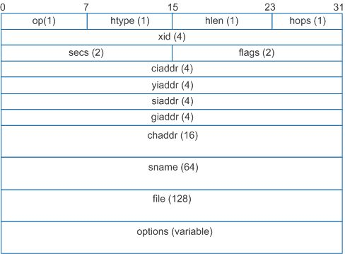
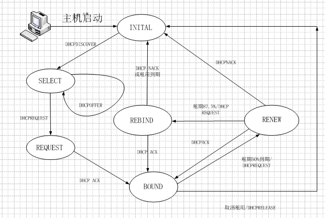

# DHCP

DHCP（Dynamic Host Configuration Protocol）动态主机配置协议，是IETF为实现IP的自动配置而设计的协议，它可以为客户机自动分配IP地址、子网掩码以及缺省网关、DNS服务器的IP地址等TCP/IP参数。 

## DHCP报文格式

### DHCP报文头
* OP：报文的操作类型。分为请求报文和响应报文。1：请求报文，2：应答报文。
   * 请求报文：DHCP Discover、DHCP Request、DHCP Release、DHCP Inform和DHCP Decline。
   * 应答报文：DHCP Offer、DHCP ACK和DHCP NAK。
* Htype：DHCP客户端的MAC地址类型。MAC地址类型其实是指明网络类型，Htype值为1时表示为最常见的以太网MAC地址类型。
* Hlen：DHCP客户端的MAC地址长度。以太网MAC地址长度为6个字节，即以太网时Hlen值为6。
* Hops：DHCP报文经过的DHCP中继的数目，默认为0。DHCP请求报文每经过一个DHCP中继，该字段就会增加1。没有经过DHCP中继时值为0。(若数据包需经过router传送，每站加1，若在同一网内，为0。)
* Xid：客户端通过DHCP Discover报文发起一次IP地址请求时选择的随机数，相当于请求标识。用来标识一次IP地址请求过程。在一次请求中所有报文的Xid都是一样的。
* Secs：DHCP客户端从获取到IP地址或者续约过程开始到现在所消耗的时间，以秒为单位。在没有获得IP地址前该字段始终为0。(DHCP客户端开始DHCP请求后所经过的时间。目前尚未使用，固定为0。)
* Flags：标志位，只使用第0比特位，是广播应答标识位，用来标识DHCP服务器应答报文是采用单播还是广播发送，0表示采用单播发送方式，1表示采用广播发送方式。其余位尚未使用。(即从0-15bits，最左1bit为1时表示server将以广播方式传送封包给client。)

### DHCP报文种类
* DHCPDISCOVER（0x01），此为Client开始DHCP过程的第一个报文
* DHCPOFFER（0x02），此为Server对DHCPDISCOVER报文的响应
* DHCPREQUEST（0x03），此报文是Client开始DHCP过程中对server的DHCPOFFER报文的回应，或者是Client续延IP地址租期时发出的报文
* DHCPDECLINE（0x04），当Client发现Server分配给它的IP地址无法使用，如IP地址冲突时，将发出此报文，通知Server禁止使用IP地址
* DHCPACK（0x05），Server对Client的DHCPREQUEST报文的确认响应报文，Client收到此报文后，才真正获得了IP地址和相关的配置信息。
* DHCPNAK（0x06），Server对Client的DHCPREQUEST报文的拒绝响应报文，Client收到此报文后，一般会重新开始新的DHCP过程。
* DHCPRELEASE（0x07），Client主动释放server分配给它的IP地址的报文，当Server收到此报文后，就可以回收这个IP地址，能够分配给其他的Client。
* DHCPINFORM（0x08），Client已经获得了IP地址，发送此报文，只是为了从DHCP SERVER处获取其他的一些网络配置信息，如route ip，DNS Ip等，这种报文的应用非常少
   
## DHCP流程

1. 主机启动，dhcp处于INI状态为了获取ip地址，DHCP客户机初始化TCP/IP，通过UDP端口67向网络中发送一个DHCPDISCOVER广播包，请求租用IP地址。该广播包中的源IP地址为0.0.0.0，目标IP地址为255.255.255.255；包中还包含客户机的MAC地址和计算机名，本地所有的dhcpserver会收到这个报文，数据包中的目标端口设为BOOTP67端口。这时dhcp会处于select状态。
2. 处于select状态的主机会接受dhcpserver发来的dhcpoffer报文，每个报文中会包含为客户机配置的信息以及server为客户机提供的租用ip，一般主机会受到零个或者多个offer报文（一般主机会响应第一个offer报文），并与server协商相关事宜，为此主机会发送一个dhcpquest报文，并进入request状态。
3. dhcpserver会给客户机一个ack的确认信息，这时一个dhcp获取过程结束。主机进入BIND稳定状态。
4. 假如主机不需要ip地址或者需要换个ip，这时主机会发送一个dhcprelease报文向dhcpserver，这时主机重新处于初始状态。
5. 一般服务器给客户机的ip地址都有租期，时间长短不等，而dhcp主机会有3个计时器，当择期过半50%，这时主机会发送一个 dhcprequest报文要求续租进入renew状态，serverdhcp会响应这个报文发送ack确认信息，这时dhcp会重新进入BOND状态。
6. 假如dhcpserver没有响应主机的请求，等租期到了87.5%这时主机会重新发送dhcprequest报文要求续租，主机进入 rebind状态，假如这时候dhcpserver不高兴（ip地址不够用）发送来一个否确认信息，这时主机会重新进入初始状态再次按照1——4步骤重新申请ip。假如收到ack老大的确认续租成功，说明这个ip我们还可以继续使用。没有响应，我们的主机只有等到我们ip租期耗尽，重新进入初始状态重新获取。