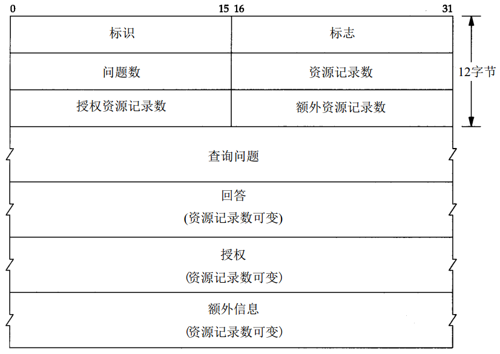
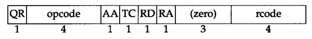
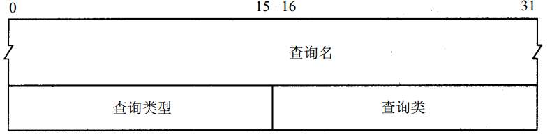
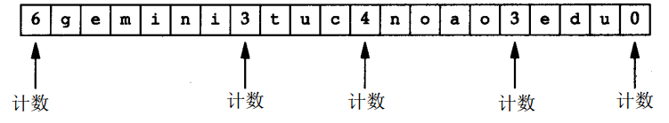
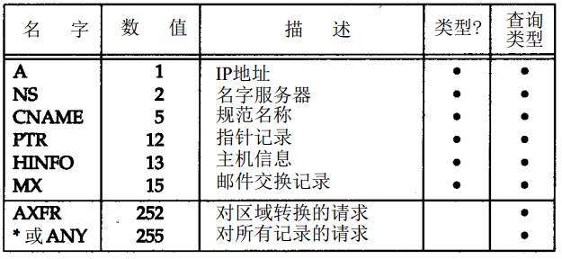
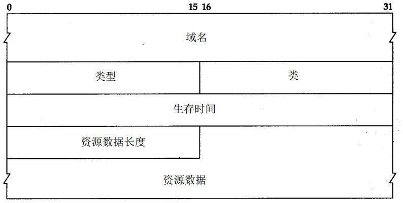
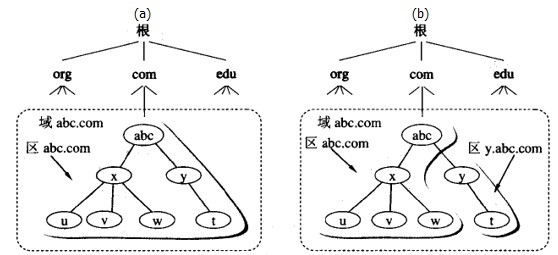
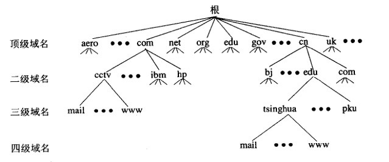
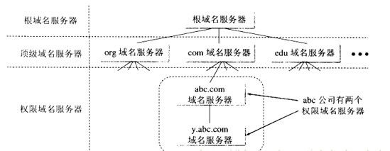

# DNS简介

域名系统（英文：Domain Name System，缩写：DNS）是互联网的一项服务。它作为将域名和IP地址相互映射的一个分布式数据库，能够使人更方便地访问互联网。

因特网上提供了数量极大的服务，如果直接使用IP地址来访问，非常不利于记忆，所以引入了域名机制，域名服务器提供了从域名到IP地址的解析服务，因特网上的域名数量极大，不可能所有的域名信息都保存在一个域名服务器中，也不能上述每个节点都采用一个域名服务器。在实际的公网DNS系统中，域名服务器采用划分区的方式来管理。

# DNS基础

DNS基本信息摘要：

* 每个结点有一个至多63个字符长的标识。这颗树的树根是没有任何标识的特殊结点。命名标识中一律不区分大写和小写。
* 以点“.”结尾的域名称为绝对域名或完全合格的域名FQDN（Full Qualified Domain Name） ，例如sun.tuc.noao.edu.。如果一个域名不以点结尾，则认为该域名是不完全的。
* 主、辅名字服务器的主要区别在于主名字服务器从磁盘文件中调入该区域的所有信息，而辅名字服务器则从主服务器调入所有信息。
* 并不是每个名字服务器都知道如何同其他名字服务器联系。 相反，每个名字服务器必须知道如何同根的名字服务器联系。

# DNS报文

DNS定义了一个用于查询和响应的报文格式：

* 这个报文由12字节长的首部和4个长度可变的字段组成。
* 标识字段由客户程序设置并由服务器返回结果。客户程序通过它来确定响应与查询是否匹配。
* 16 bit的标志字段被划分为若干子字段。
* 随后的4个16bit字段说明最后4个变长字段中包含的条目数。

16 bit的标志字段定义：

* QR是1bit字段：0表示查询报文，1表示响应报文。
* opcode是一个4 bit字段：通常值为 0（标准查询） ，其他值为 1（反向查询）和 2（服务器状态请求） 。
* AA是1bit标志，表示“授权回答 (authoritative answer)” 。该名字服务器是授权于该域的。
* TC是1bit字段，表示“可截断的 ( truncated )” 。使用UDP时，它表示当应答的总长度超过512字节时，只返回前512个字节。
* RD是1bit字段表示“期望递归（recursion desired ）” 。该比特能在一个查询中设置，并在响应中返回。这个标志告诉名字服务器必须处理这个查询，也称为一个递归查询。如果该位为 0，且被请求的名字服务器没有一个授权回答，它就返回一个能解答该查询的其他名字服务器列表。
* RA是1bit字段，表示“可用递归” 。如果名字服务器支持递归查询，则在响应中将该比特设置为1。在后面的例子中可看到大多数名字服务器都提供递归查询，除了某些根服务器。
* 随后的3 bit字段必须为0。
* rcode是一个4bit的返回码字段。通常的值为0（没有差错）和3（名字差错）。名字差错只有从一个授权名字服务器上返回，它表示在查询中制定的域名不存在。

## DNS查询报文

查询名是要查找的名字，它是一个或多个标识符的序列。每个标识符以首字节的计数值来说明随后标识符的字节长度，每个名字以最后字节为0结束，长度为0的标识符是根标识符。计数字节的值必须是0~63的数，因为标识符的最大长度仅为63。

如何存储域名gemini.tuc.noao.edu：

每个问题有一个查询类型，而每个响应（也称一个资源记录，我们下面将谈到）也有一个类型。大约有 2 0个不同的类型值，其中的一些目前已经过时。

## DNS响应报文

DNS报文中最后的三个字段，回答字段、授权字段和附加信息字段，均采用一种称为资源记录RR（Resource Record）的相同格式。

* 域名是记录中资源数据对应的名字。它的格式和前面介绍的查询名字段格式相同。
* 类型说明RR的类型码。它的值和前面介绍的查询类型值是一样的。类通常为1 ，指Internet数据。
* 生存时间字段是客户程序保留该资源记录的秒数。资源记录通常的生存时间值为2天。
* 资源数据长度说明资源数据的数量。该数据的格式依赖于类型字段的值。对于类型1（A记录）资源数据是4字节的IP地址。

# 因特网DNS实现

在实际的公网DNS系统中，域名服务器采用划分区的方式来管理。一个服务器所负责管辖的范围叫做区(zone)，如果我们把域名空间结构中的根比作国家，顶级域名比作省级行政单位，二级域名看作是市级单位、三级、四级看作是镇和乡，那么自然地，我们会想到管辖国家的是总理，管辖省级单位的是省长，下面还有市长、镇长等等。

# 因特网域名空间结构

顶级域名是域名的最后一个部分，即是域名最后一点之后的字母，例如在http://example.com这个域名中，顶级域是.com（或.COM），大小写视为相同。二级域名是域名的倒数第二个部分，例如在http://example.com这个域名中，二级域名是example。以此类推。

# 因特网域名服务器层次

## 根域名服务器

根域名服务器是最高层次的域名服务器(就好像国家总理一样)，也是最重要的域名服务器。全球有13个根域名服务器名称，分别是（它们是按照字母排列命名的）：
* a.root-servers.net.
* b.root-servers.net.
* c.root-servers.net.
* d.root-servers.net.
* e.root-servers.net.
* f.root-servers.net.
* g.root-servers.net.
* h.root-servers.net.
* i.root-servers.net.
* j.root-servers.net.
* k.root-servers.net.
* l.root-servers.net.
* m.root-servers.net.

当然，并不是一个名字对应一台物理服务器的地址，一个根服务器的名字可以作为入口对应一组服务器集群来提供域名解析服务。

## 顶级域名服务器

顶级域名服务器就好像国家总理下面的各个省长，管辖省级单位。在DNS中，它们负责管理在该顶级域名服务器注册的下一级域名(二级域名)。所有顶级域名服务器的名称和IP地址是在根服务器注册的，也就是说，根域名服务器知道所有的顶级域名服务器的名称和IP地址。

## 权威域名服务器

权威域名服务器负责一个区的域名服务器，就好像省长以下的那些市长、镇长、乡长等行政官。顶级域名服务器也可以算作是权威域名服务器，只不过由于其特殊性，我们专门把它划分为一类。因此权威域名服务器通常是指顶级域名以下的管理二级、三级、四级等域名的服务器。

## 本地域名服务器

本地域名服务器，这类服务器不属于上面的层次结构，当一个主机(个人电脑)发出DNS请求时，查询请求就被发送到本地域名服务器，本地域名服务器负责回答这个查询，或者代替主机向域名空间中不同层次的权威域名服务器查询，再把查询的结果返回给主机。

# DNS解析过程

下面的图示表示了一个域名的解析过程以及各个类型的域名服务器所处的位置。

