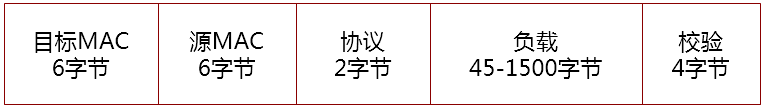

# 以太网

以太网（Ethernet）是一种计算机局域网技术，是目前应用最普遍的局域网技术，取代了其他局域网标准如令牌环、FDDI和ARCNET。

## 以太网拓扑

以太网的标准拓扑结构为总线型拓扑，当今快速以太网使用交换机来进行网络连接和组织，以太网的拓扑结构变成了星型，但在逻辑上，以太网仍然使用总线型拓扑和CSMA/CD的总线技术。

* 总线型拓扑特点
   * 同一时刻仅能有一个设备占用总线，即一个节点发送报文
   * 一个节点发送报文总线上的其他设备均能收到（交换机广播）

## CSMA/CD

CSMA/CD（Carrier Sense Multiple Access/Collision Detection，即载波多重访问/碰撞侦测），在传统的共享以太网中，所有的节点共享传输介质。如何保证传输介质有序、高效地为许多节点提供传输服务，就是以太网的介质访问控制协议要解决的问题。和CSMA/CD相关的还有一个概念叫冲突域，在同一个冲突域中的节点不能同时发包，例如HUB设备连接的节点，严重影响网络总体带宽，后来的以太网交换机解决冲突域的问题。

> HUB：工作在物理层，从一个端口接收到报文后，会复制到其他端口并发出，意味着同一时刻HUB连接的节点同一时刻只能有一个节点发包，即在同一个冲突域，性能差是必然的。

## 以太网规范

* 每个站点发送的以太网帧，可以同时被多个站点接收
* 站点通过以太网帧的目的MAC地址来确定该报文是发送给自己的
* 以太网帧的发送方和接收方必须在同一个网络内

## OS发包原理

根据以太网规范，在以太网中的节点，发包流程如下：

* 判断接收方是否在同一个网络
    * 相同网络，以接收方为下一跳目的地封装以太网帧，并发送报文到网络上（目的MAC = 接收方的MAC， 目的IP = 接收方的IP）
    * 不同网络，以网关为下一跳目的地封装以太网帧，并发送报文到网络上（目的MAC = 网关的MAC， 目的IP = 接收方的IP）

> 封装以太网帧时，需要知道接收方的MAC地址，获取MAC地址的方式采用ARP协议实现

## 以太网帧格式

以太网帧格式分类：

* Ethernet II即DIX 2.0：Xerox与DEC、Intel在1982年制定的以太网标准帧格式。Cisco名称为：ARPA。
* Ethernet 802.3 raw：Novell在1983年公布的专用以太网标准帧格式。Cisco名称为：Novell-Ether。
* Ethernet 802.3 SAP：IEEE在1985年公布的Ethernet 802.3的SAP版本以太网帧格式。Cisco名称为：SAP。
* Ethernet 802.3 SNAP：IEEE在1985年公布的Ethernet 802.3的SNAP版本以太网帧格式。Cisco名称为：SNAP。

Ethernet II帧格式

以太网帧常用的协议类型如下：

* 0x0800 网际协议（IPV4）
* 0x0806 地址解析协议（ARP ： Address Resolution Protocol）
* 0x8100 VLAN报文
* 0x814C 简单网络管理协议（SNMP：Simple Network Management Protocol）
* 0x88CC 链接层发现协议（LLDP：Link Layer Discovery Protocol）

## MAC地址分类

以太网是以48位的MAC地址来进行寻址的，MAC地址分为如下三类：

* 单播地址，例如物理网卡预置的MAC地址
* 广播地址，地址为FF-FF-FF-FF-FF-FF，同网络上所有节点均会接收到该报文
* 组播地址，作为组播IP地址的一个映射，要求第48位bit值为1即可，即MAC地址的第一个字节内容为"XXXXXXX1"，广播地址是特殊的组播地址

## 以太网规范对云网络的要求

根据上述以太网规范和OS发包原理，对于虚拟化网络和容器网络的方案，需要解决如下问题，不同的解法构成了不同的网络方案：

* MAC地址如何获取
   * 代答
   * 接收方应答
* IP地址如何获取
   * DHCP方式
   * 静态配置

