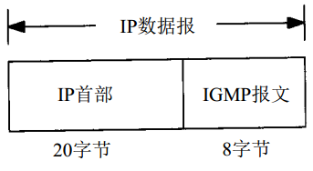
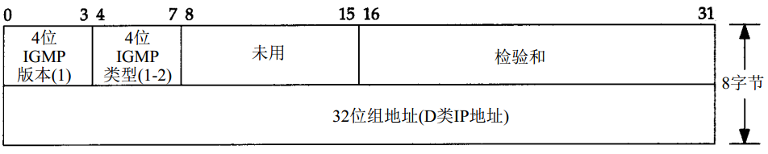
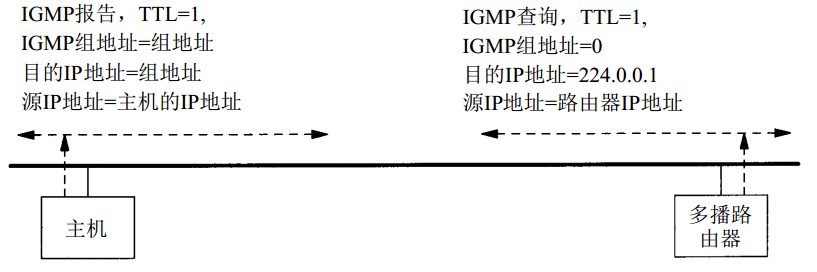

# 简介

IGMP, Internet组管理协议，它让一个物理网络上的所有系统知道主机当前所在的多播组。多播路由器需要这些信息以便知道多播数据报应该向哪些接口转发。 

# IGMP报文

IGMP报文通过IP数据报进行传输。不像我们已经见到的其他协议， IGMP有固定的报文长度，没有可选数据。

## IGMP报文格式

IGMP类型：

* 1说明是由多播路由器发出的查询报文。
* 2说明是主机发出的报告报文。

组地址为D类IP地址：

* 在查询报文中组地址设置为0。
* 在报告报文中组地址为要参加的组地址。

# IGMP协议

## 加入一个多播组

多播的基础就是一个进程的概念（使用的术语进程是指操作系统执行的一个程序） ，该进程在一个主机的给定接口上加入了一个多播组。在一个给定接口上的多播组中的成员是动态的—它随时因进程加入和离开多播组而变化。

这里所指的进程必须以某种方式在给定的接口上加入某个多播组。进程也能离开先前加入的多播组。这些是一个支持多播主机中任何API所必需的部分。使用限定词“接口”是因为多播组中的成员是与接口相关联的。一个进程可以在多个接口上加入同一多播组。

这里暗示一个主机通过组地址和接口来识别一个多播组。主机必须保留一个表，此表中包含所有至少含有一个进程的多播组以及多播组中的进程数量。

## IGMP报告和查询

多播路由器使用IGMP报文来记录与该路由器相连网络中组成员的变化情况。使用规则如下：

1. 当第一个进程加入一个组时，主机就发送一个IGMP报告。如果一个主机的多个进程加入同一组，只发送一个IGMP报告。这个报告被发送到进程加入组所在的同一接口上。
2. 进程离开一个组时，主机不发送IGMP报告，即便是组中的最后一个进程离开。主机知道在确定的组中已不再有组成员后，在随后收到的IGMP查询中就不再发送报告报文。
3. 多播路由器定时发送IGMP查询来了解是否还有任何主机包含有属于多播组的进程。多播路由器必须向每个接口发送一个IGMP查询。因为路由器希望主机对它加入的每个多播组均发回一个报告，因此IGMP查询报文中的组地址被设置为0。
4. 主机通过发送IGMP报告来响应一个IGMP查询，对每个至少还包含一个进程的组均要发回IGMP报告。

使用这些查询和报告报文，多播路由器对每个接口保持一个表，表中记录接口上至少还包含一个主机的多播组。当路由器收到要转发的多播数据报时，它只将该数据报转发到（使用相应的多播链路层地址）还拥有属于那个组主机的接口上。

多播路由器发送IGMP查询报文：

* 目的IP地址为224.0.0.1指定为所有主机，当接口初始化后，所有具备多播能力接口上的主机均自动加入这个多播组。
* 待传多播数据报的TTL被设置为1，这将使多播数据报仅局限在同一子网内传送； 从224.0.0.0到224.0.0.255的特殊地址空间是打算用于多播范围不超过1跳的应用。

## 实现细节

为改善该协议的效率，有许多实现的细节要考虑：

* 当一个主机首次发送IGMP报告（当第一个进程加入一个多播组）时， 并不保证该报告被可靠接收（因为使用的是IP交付服务）。下一个报告将在间隔一段时间后发送。这个时间间隔由主机在0~10秒的范围内随机选择。
* 当一个主机收到一个从路由器发出的查询后，并不立即响应，而是经过一定的时间间隔后才发出一些响应（采用“响应”的复数形式是因为该主机必须对它参加的每个组均发送一个响应）。
* 如果一个主机在等待发送报告的过程中，却收到了发自其他主机的相同报告，则该主机的响应就可以不必发送了。因为多播路由器并不关心有多少主机属于该组，而只关心该组是否还至少拥有一个主机。

