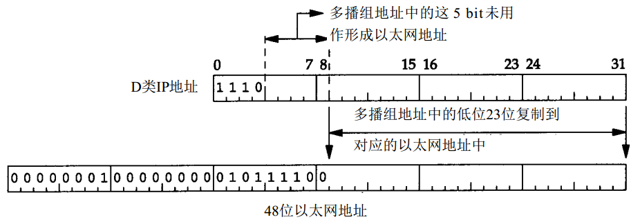
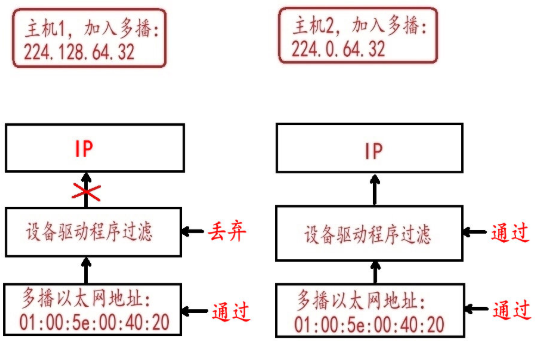

# 简介

IP报文有三种传输模式：

* 单播
 * 报文发送给某个主机，其他主机不会收到报文；
 * 如果有大量主机希望获得数据包的同一份拷贝时，将导致发送者负担沉重、延迟长、网络拥塞；
* 广播
 * 报文发送给某个网络下的所有主机，仅个别主机会处理该报文，主机资源浪费；
 * 广播意味着网络向子网每一个主机都投递一份数据包，不论这些主机是否乐于接收该数据包；
* 组播
 * 报文发送给一个组中的所有主机， 主机可以自主加入和退出组，仅对该组感兴趣的主机会收到报文；
 * 组播解决了单播和广播方式效率低的问题。当网络中的某些用户需求特定信息时，组播源（即组播信息发送者）仅发送一次信息，组播路由器借助组播路由协议为组播数据包建立树型路由，被传递的信息在尽可能远的分叉路口才开始复制和分发。

 
# 组播地址

## 组播IP地址

组播报文的目的地址使用D类IP地址， D类地址不能出现在IP报文的源IP地址字段。 IP地址范围：224.0.0.0--239.255.255.255(28bits)：

* 224.0.0.0～224.0.0.255
  * 为预留的组播地址（永久组地址）
  * 224.0.0.0 基准地址（保留）。
  * 224.0.0.1 所有主机的地址 （包括所有路由器地址）
  * 224.0.0.2 所有组播路由器的地址
  * ...
* 224.0.1.0～224.0.1.255
  * 为公用组播地址，可以用于Internet；
* 224.0.2.0～238.255.255.255
  * 为用户可用的组播地址（临时组地址），全网范围内有效。
* 239.0.0.0～239.255.255.255
  * 为本地管理组播地址，仅在特定的本地范围内有效。

  
## 组播mac地址

IANA拥有一个以太网地址块，即高位 24 bit为00:00:5e（十六进制表示） ，这意味着该地址块所拥有的地址范围从00:00:5e:00:00:00到00:00:5e:ff:ff:ff。IANA将其中的一半分配为多播地址。
为了指明一个多播地址，任何一个以太网地址的首字节必须是01，这意味着与IP多播相对应的以太网地址范围从 01:00:5e:00:00:00到01:00:5e:7f:ff:ff。
这种地址分配将使以太网多播地址中的23bit与IP多播组号对应起来，通过将多播组号中的低位23bit映射到以太网地址中的低位23bit实现。
由于多播组号中的最高5bit在映射过程中被忽略，因此每个以太网多播地址对应的多播组是不唯一的。 32个不同的多播组号被映射为一个以太网地址。

既然地址映射是不唯一的，那么设备驱动程序或 IP 层就必须对数据报进行过滤。因为网卡可能接收到主机不想接收的多播数据帧，如下图，假如主机 1 加入的多播为 224.128.64.32， 主机 2 加入的多播为 224.0.64.32，我们想给 224.0.64.32 所在的多播组 ( 主机 2 ) 发送信息，数据经过网卡时，224.128.64.32 (主机 1 ) 和 224.0.64.32 (主机 2 ) 所在多播组的网卡都会收到数据，因为它们的 MAC 地址都是 01:00:5e:00:40:20。这时候，如果网卡不提供足够的多播数据帧过滤功能，设备驱动程序就必须接收所有多播数据帧，然后对它们进行过滤，这个过滤过程是网络驱动或IP层自动完成。

# 组播协议体系结构

组播协议分为：

* 主机-路由器之间的组成员关系协议
  * IGMP（互连网组管理协议）
* 路由器-路由器之间的组播路由协议
  * 域内组播路由协议
    * PIM-SM、PIM-DM、DVMRP等协议
  * 域间组播路由协议
    * MBGP、MSDP等协议
* 二层组播协议
  * IGMP Snooping、CGMP等

  
# 组播协议

组播协议分为主机与路由器之间的组成员关系协议和路由器与路由器之间的组播路由协议。

## IGMP

IGMP协议运行于主机和与主机直接相连的组播路由器之间，主机通过此协议告诉本地路由器希望加入并接受某个特定组播组的信息，同时路由器通过此协议周期性地查询局域网内某个已知组的成员是否处于活动状态（即该网段是否仍有属于某个组播组的成员），实现所连网络组成员关系的收集与维护。

IGMP有三个版本，IGMPv1由RFC1112定义，目前通用的是IGMPv2，由RFC2236定义。IGMPv3目前仍然是一个草案。

* IGMPv1中定义了基本的组成员查询和报告过程；
* IGMPv2在此基础上添加了组成员快速离开的机制；
* IGMPv3中增加的主要功能是成员可以指定接收或指定不接收某些组播源的报文。

IGMPv2通过查询器选举机制为所连网段选举唯一的查询器。查询器周期性的发送普遍组查询消息进行成员关系查询；主机发送报告消息来应答查询。
当要加入组播组时，主机不必等待查询消息，主动发送报告消息。
当要离开组播组时，主机发送离开组消息；收到离开组消息后，查询器发送特定组查询消息来确定是否所有组成员都已离开。

通过上述IGMP机制，在组播路由器里建立起一张表，其中包含路由器的各个端口以及在端口所对应的子网上都有哪些组的成员。当路由器接收到某个组G的数据报文后，只向那些有G的成员的端口上转发数据报文。至于数据报文在路由器之间如何转发则由路由协议决定，IGMP协议并不负责。

## IGMP Snooping

IGMP Snooping的实现机理是：交换机通过侦听主机发向路由器的IGMP成员报告消息的方式，形成组成员和交换机接口的对应关系；交换机根据该对应关系将收到组播数据包只转给具有组成员的接口。
IGMP Proxy与IGMP Snooping实现功能相同但机理相异：IGMP snooping只是通过侦听IGMP的消息来获取有关信息，而IGMP Proxy则拦截了终端用户的IGMP请求并进行相关处理后，再将它转发给上层路由器。

## CGMP

CGMP(Cisco Group Management Protocol）是Cisco基于客户机/服务器模型开发的私有协议，在CGMP的支持下，组播路由器能够根据接收到的IGMP数据包通知交换机哪些主机何时加入和脱离组播组，交换机利用由这些信息所构建的转发表来确定将组播数据包向哪些接口转发。GMRP是主机到以太网交换机的标准协议，它使组播用户可以在第二层交换机上对组播成员进行注册。

## PIM-SM

众多的组播路由协议中，目前应用最多的协议是 PIM-SM稀疏模式协议无关组播。
在PIM-SM域中，运行PIM-SM协议的路由器周期性的发送Hello消息，用以发现邻接的PIM路由器，并且负责在多路访问网络中进行指定路由器（DR）的选举。这里，DR负责为其直连组成员朝着组播分发树根节点的方向发送"加入/剪枝"消息，或是将直连组播源的数据发向组播分发树。

