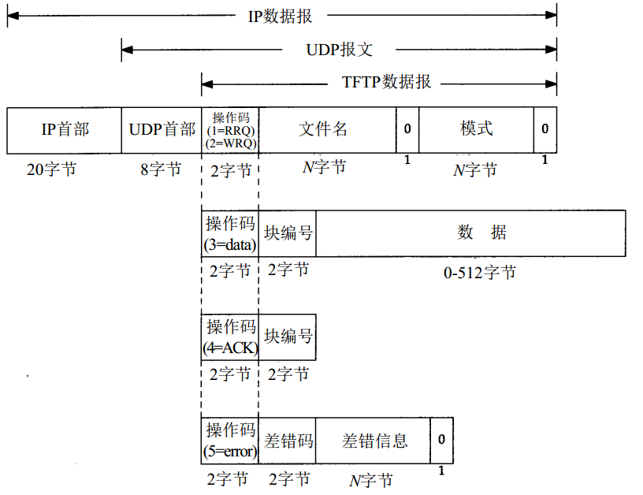

# TFTP

TFTP( Trivial File Transfer Protocol) 即简单文件传送协议，最初打算用于引导无盘系统（通常是工作站或 X终端）。

为了保持简单和短小，TFTP将使用UDP。TFTP的代码（和它所需要的UDP、IP和设备驱动程序）都能适合只读存储器。

既然TFTP使用不可靠的UDP，TFTP就必须处理分组丢失和分组重复。分组丢失可通过发送方的超时与重传机制解决（注意存在一种称为“魔术新手综合症(sorcerer’s apprenticesyndrome) ”的潜在问题，如果双方都超时与重传，就可能出现这个问题。

TFTP协议需要客户进程向服务器进程的UDP熟知端口（69）发送第一个分组（RRQ或WRQ）。之后服务器进程便向服务器主机申请一个尚未使用的端口，服务器进程使用这个端口来进行请求客户进程与服务器进程间的其他数据交换。

# TFTP协议

* 第一个是读写请求报文（RRQ/WRQ）；
* 第二个是数据报文
* 第三个是ACK报文
* 第四个是差错报文，它的操作码为5。它用于服务器不能处理读请求或写请求的情况。

## TFTP读文件

以读一个文件作为例子：

1. TFTP客户需要发送一个读请求说明要读的文件名和文件模式(mode) 。
2. 如果这个文件能被这个客户读取， TFTP服务器就返回一个块编号为1的数据分组。
3. TFTP客户又发送一个块编号为1的ACK。TFTP服务器随后发送块编号为2的数据。 
4. TFTP客户发回块编号为2的ACK。重复这个过程直到这个文件传送完。除了最后一个数据分组可含有不足512字节的数据，其他每个数据分组均含有512字节的数据。

## TFTP写文件

以写一个文件作为例子：

1. TFTP客户发送WRQ指明文件名和模式。
2. 如果该文件能被该客户写，TFTP服务器就返回块编号为0的ACK包。该客户就将文件的头512字节以块编号为1发出。服务器则返回块编号为1的ACK。

