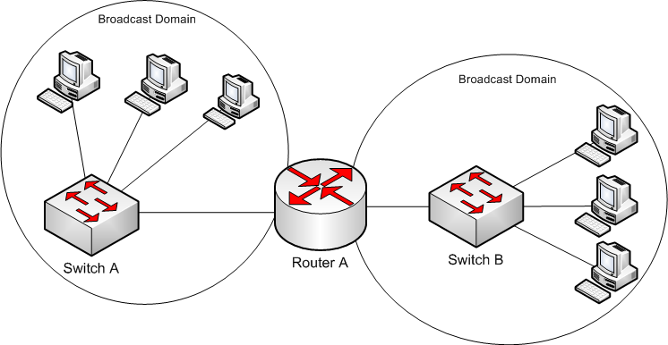
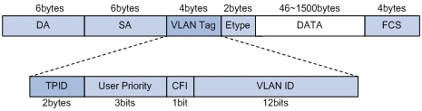
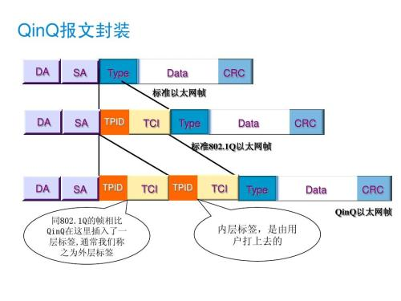

# VLAN

VLAN（Virtual LAN）虚拟局域网，是执行802.1Q的协议标准，在一物理LAN内划分出多个虚拟LAN的，每个VLAN是一个广播域，这就缩小了广播域的范围，各个VLAN之间不能直接通信。

## VLAN的作用

解决二层交换机只能构建单一的广播域的问题，当网络规模增大时，频繁的广播报文会严重影响到网络整体的传输性能。

### 常见广播报文
* ARP请求：建立IP地址和MAC地址的映射关系。
* RIP：一种路由协议。
* DHCP：用于自动设定IP地址的协议。

## VLAN报文格式

IEEE 802.1Q 标准定义了 VLAN Header 的格式。它在普通以太网帧结构协议之前4bytes的 VLAN Tag/Header 数据，其中包括 12bits 的 VLAN ID。VLAN ID的最大值是 4096， 但是有效值范围是 1- 4094。

### VLAN的限制
* VLAN 使用 12-bit 的 VLAN ID，因此第一个不足之处就是最多只支持 4096 个 VLAN 网络

## QinQ

QinQ技术〔也称Stacked VLAN 或Double VLAN〕，标准出自IEEE 802.1ad，通过在以太帧中堆叠两个802.1Q报头，有效地扩展了VLAN数目，使VLAN的数目最多可达4094x4094个。

### QinQ产生背景

* 解决日益紧缺的公网VLAN ID资源问题
   * 4096个VLAN不能满足大规模网络的需求，运营商需要根据VLAN ID对接入用户进行区分。
* 二层VPN技术能够透传用户的VLAN信息
   * 二层VPN技术能够透传用户的VLAN信息及以太网配置信息
   

### QinQ报文格式
