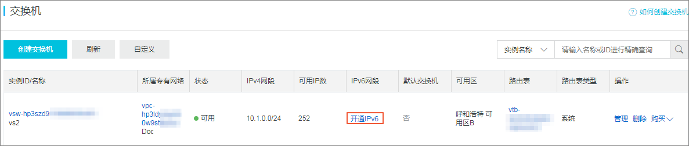

# 网络互联简介

VPC网络是一个隔离的网络环境，需要和其他网络互通，阿里云通过提供如下服务提供专有网络互联：

* 弹性公网IP（EIP）
* NAT网关
* IPV6网关
* IPV6转化服务
* VPN网关
* 高速通道/对等连接（不再支持，使用云企业网）
* 高速通道/物理专线连接
* 智能接入网关&云连接网
* 云企业网

# 弹性公网IP

弹性公网IP（Elastic IP Address，简称EIP），是可以独立购买和持有的公网IP地址资源。EIP可绑定到专有网络类型的ECS实例、专有网络类型的私网SLB实例和NAT网关上。

## 弹性公网IP申请

弹性公网IP申请总结：

1. 默认为BGP多线；
2. 支持根据EIP的IP或者ID申请本账号下被释放的历史EIP，但如果要申请的历史EIP已分配给其他用户使用，则无法申请；
3. 流量费用支持固定带宽和流量两种模式；
4. 支持的带宽范围为1mbps-200mbps；

## 弹性公网IP绑定云资源

您可以将弹性公网IP绑定到NAT网关、ECS实例、弹性网卡、SLB实例和高可用虚拟IP上。

要绑定的NAT网关必须满足以下条件：

* NAT网关的所属账号在2017年11月3日前没有购买过NAT带宽包。
* NAT网关的地域必须和EIP的地域相同。
* 一个NAT网关最多可以绑定20个EIP。

要绑定的ECS实例必须满足以下条件：

* ECS实例的网络类型必须是专有网络。
* ECS实例的地域必须和EIP的地域相同。
* ECS实例必须处于运行中或停止状态。
* ECS实例没有配置固定公网IP或绑定其他EIP。
* 一个ECS实例只能绑定一个EIP。

要绑定的SLB实例必须满足以下条件：

* SLB实例的网络类型必须是专有网络。
* SLB实例的地域必须和EIP的地域相同。
* 一个SLB实例只能绑定一个EIP。

### 弹性公网IP绑定弹性网卡

EIP支持绑定弹性网卡。通过绑定弹性网卡，您可以构造出更健壮、更灵活、扩展性更强的IT解决方案，同时让单台服务器具备多个公网IP的能力。

弹性网卡本身提供一个私网IP，在绑定EIP后，相当于同时具备了私网IP和公网IP。在将绑定了EIP的弹性网卡从ECS实例上迁移时，也同时完成了私网IP和公网IP的迁移，为同时使用公网IP和私网IP的云服务器提供了高可靠和高可用的IP迁移解决方案。

一个ECS实例支持绑定多个弹性网卡，您可以为每个弹性网卡绑定一个EIP，这样该ECS实例就拥有了多个公网IP。配合安全组规则，您可以灵活的使用这些公网IP对外提供服务。

EIP绑定弹性网卡分为以下三种模式：

* 普通模式
  * EIP在操作系统内部的弹性网卡上不可见；
  * 支持绑定主弹性网卡和辅助弹性网卡；
  * 辅助弹性网卡可绑定的EIP数等于辅助弹性网卡的私网IP数量，不超过10个；
  * 辅助弹性网卡的私网功能可用；
* 网卡可见模式
  * EIP在操作系统内部的弹性网卡上可见；
  * 支持绑定辅助弹性网卡；
  * 辅助弹性网卡可绑定的EIP数为1；
  * 辅助弹性网卡的私网功能不可用；
* 多EIP网卡可见模式
  * EIP在操作系统内部的弹性网卡上可见；
  * 支持绑定辅助弹性网卡；
  * 辅助弹性网卡可绑定的EIP数为10，需要提工单申请；
  * 辅助弹性网卡的私网功能可用；

### 弹性公网IP绑定高可用虚拟IP

您可以将弹性公网IP绑定到高可用虚拟IP上，使高可用虚拟IP具备公网通信的能力。

1、阿里云上提工单，让其开通havip，高可用虚拟ip：

2、到专有VPC网络的高可用虚拟IP，点击创建高可用虚拟IP：

3、绑定公网IP：

要绑定的高可用虚拟IP必须满足以下条件：

* 高可用虚拟IP实例的地域必须和EIP的地域相同。
* 高可用虚拟IP实例必须处于可用或已分配状态。
* 一个高可用虚拟IP实例只能绑定一个EIP。

# NAT网关

NAT 网关（NAT Gateway）是一款企业级的 VPC 公网网关，提供 NAT 代理（SNAT、DNAT）、10Gbps 级别的转发能力、以及跨可用区的容灾能力。NAT 网关与共享带宽包配合使用，可以组合成为高性能、配置灵活的企业级网关。

## NAT网关规格

NAT网关提供小型、中性、大型和超大型-1规格。**不同规格的NAT网关会影响SNAT最大连接数和SNAT每秒新建连接数，但不会影响DNAT性能**。

## NAT网关创建

NAT网关创建总结：

1. 仅提供按天计费；
2. 根据NAT网关的连接数制定规格；
3. 创建时未指定EIP，需要在创建后指定EIP，一个NAT网关最多可以绑定20个EIP；

NAT网关和EIP创建总结：

1. 仅提供按天计费；
2. 根据NAT网关的连接数制定规格；
3. 创建时可以指定创建新EIP；

## NAT网关绑定/解绑EIP

NAT网关作为一个网关设备，需要绑定公网IP才能正常工作。创建NAT网关后，您可以为NAT网关绑定弹性公网IP（EIP）。

NAT网关绑定/解绑EIP总结：

1. 支持从现有EIP中选择绑定，一个NAT网关最多可以绑定20个EIP；
2. 支持新申请EIP并绑定；
3. 支持绑定多个EIP；

## NAT网关SNAT条目管理

您可以使用NAT网关的SNAT功能，为专有网络中无公网IP的ECS实例提供访问互联网的代理服务。

NAT网关SNAT条目管理总结：

1. 支持交换机粒度，该交换机下所有ECS均可以通过NAT网关访问公网，需要指定：交换机、EIP（不能被用于DNAT）；
2. 支持ECS粒度，该ECS可以通过NAT网关访问公网，需要指定：ECS、EIP（不能被用于DNAT）；

## NAT网关DNAT条目管理

NAT网关支持DNAT功能，将NAT网关上的公网IP映射给ECS实例使用，使ECS实例能够提供互联网服务。DNAT支持端口映射和IP映射。

NAT网关DNAT条目管理总结：

1. 支持单个EIP映射到ECS实例；
2. 支持EIP+端口映射到ECS实例的某个端口；
3. 支持自输入目标ECS实例的私网IP；

## NAT网关DDoS基础防护

DDoS攻击是一种针对目标系统的恶意网络攻击行为，会导致被攻击者的业务无法正常访问。阿里云免费为NAT网关提供最高5G的DDoS基础防护，DDoS基础防护服务可以有效防止DDoS攻击。

启用DDoS基础防护功能后，所有来自Internet的流量都将先经过云盾再到达NAT网关，云盾会针对常见的攻击进行清洗过滤。云盾DDoS基础防护可以防御SYN Flood、UDP Flood、ACK Flood、ICMP Flood 和DNS Flood等DDoS攻击。

云盾DDoS基础防护根据NAT网关实例的EIP带宽自动设定清洗阈值和黑洞阈值。当入方向流量达到阈值上限时，触发清洗和黑洞：

* 清洗：当来自Internet的攻击流量超过清洗阈值或符合攻击流量模型特征时，云盾将启动清洗操作，清洗操作包括过滤攻击报文、流量限速、包限速等。
* 黑洞：当来自Internet的攻击流量超过黑洞阈值时，为保护集群安全，流量将会被黑洞处理，即所有入流量全部被丢弃。

## NAT网关监控

结合阿里云云监控服务，您可以查看NAT网关的云监控数据，如连接数、容量限制丢弃连接数和限速丢弃连接数等。

# IPV6转化服务

Pv6转换服务（IPv6 Translation Service），是一种有状态的IPv6和IPv4网络地址与协议转换服务。通过IPv6转换服务，具备公网IPv4地址的服务器可快速面向IPv6网络侧用户提供访问服务。

## 基本概念

* IPv6转换服务
  * 阿里云提供的一种实现IPv6和IPv4网络地址协议转换的服务。
* IPv6转换实例
  * IPv6转换实例是一个运行的IPv6转换服务。要使用IPv6转换服务，必须先创建一个IPv6转换实例。
* 实例IPv6地址
  * 系统为创建的IPv6转换实例分配的IPv6地址。您可以将域名解析到该IPv6地址，用于面向IPv6用户提供访问服务。 
* 实例IPv4地址
  * 系统为创建的IPv6转换实例分配的公网IPv4地址。
* IPv6转换映射条目
  * IPv6转换服务映射条目规定了如何将来自IPv6客户端的请求转发给后端IPv4服务器。
  * 根据IPv6转换映射条目定义的转发规则，IPv6转换实例将接收的IPv6客户端请求，经过IPv6和IPv4网络地址和协议转换后，通过IPv4公网将数据转发给后端IPv4服务器的应用。 
* 后端IPv4服务器
  * 需要提供IPv6访问的纯IPv4服务器，该服务器具备公网IPv4地址。
* 前端IPv6端口
  * 用来接收请求并向后端IPv4服务器进行请求转发的IPv6转换实例的端口。
* 后端IPv4端口
  * 具备公网IPv4地址的服务器开放的用来接收请求的后端端口。

## 使用场景

**场景一：系统部署在本地IDC机房**

现有的IT系统部署在本地IDC机房，IDC机房为纯IPv4网络。使现有IT系统支持IPv6是一个复杂的系统工程，改造难度大，周期通常以年计算。在本地IT系统升级IPv6的同时，如果需要快速面向IPv6用户提供服务，则可以使用IPv6转换服务。

**场景二：系统部署在公共云**

现有的IT系统部署在公共云，所在所使用的服务尚未支持IPv6，或尚未支持IPv4/IPv6双栈时，云上IT系统可通过阿里云IPv6转换服务快速支持IPv6用户访问。

## 使用限制

## IPV6转化实例创建

**1、创建IPv6转换服务实例**

实例配置说明:

* 地域：选择IPv6转换服务实例的地域。
* 实例规格：选择实例的规格，不同规格实例的最大连接数也不同。 公测期间只提供小型规格，该规格的最大连接数为50000，新建连接数为5000。
* 计费方式：IPv6转换服务实例按带宽计费，与实际使用流量无关。
* 带宽：选择实例的带宽。
* 名称：输入实例的名称。
* 购买时长：选择实例的购买时长。实例到期后，自动释放。

**2、添加映射转发条目**

找到目标IPV6转化实例，然后单击更多 > 添加映射条目，配置转发条目：

* 后端IPv4地址：要通过映射规则提供IPv6访问的服务器的公网IPv4地址。
* 前端IPv6端口：用来接收请求并向后端IPv4服务器进行请求转发的IPv6转换实例的端口。
* 后端IPv4端口：指定的公网IPv4地址的服务器开放用来接收请求的后端端口。
* 协议类型： 用来接收请求并向后端IPv4服务器进行请求转发的协议。
* 条目带宽峰值 ：所有IPv6转换映射条目的带宽峰值之和不能超过实例的带宽峰值。
* 条目名称：映射条目的名称。

当实例状态变为正常时，表示配置生效。您可以单击监控图标查看流入流量、数据包、连接数等信息：

# IPV6网关

IPv6网关（IPv6 Gateway）是专有网络（VPC）的一个IPv6互联网流量网关。您可以通过配置IPv6互联网带宽和仅主动出规则，灵活定义IPv6互联网出流量和入流量。

IPV6网络通信分类：

* IPv6私网通信
  * 默认申请的专有网络IPv6地址的互联网带宽为0Mbps，只具备私网通信能力。VPC网络中的云实例只可以通过IPv6地址访问同一个VPC中的其他IPv6地址，不允许通过该IPv6地址访问互联网，也无法被互联网的IPv6终端访问。
* IPv6互联网通信
  * 您可以通过为申请的IPv6地址购买互联网带宽的方式，使VPC网络中的云实例可以通过该IPv6地址访问互联网，同时也允许IPv6客户端通过互联网访问VPC网络中的云实例。
  * 您可以随时将IPv6地址的互联网带宽设置为零。设置后，该IPv6地址只拥有私网通信能力。
* IPv6互联网通信—仅主动访问
  * 您可以通过配置仅主动出规则，使IPv6地址可以主动访问互联网，但不允许IPv6客户端通过互联网访问VPC网络中的云实例。
  * 您可以随时删除仅主动出规则。删除后，具有公网带宽的IPv6地址不仅可以主动访问互联网，同时也允许IPv6客户端通过互联网访问VPC网络中的云实例。

## 基本概念

* IPv6地址	
  * 系统为VPC中实例分配的IPv6地址。IPv6地址在二进制下长度为128位，以16位为一组，每组以“:”隔开。
  * 通常每组以4位十六进制数表示。IPv6地址的示例如下：2001:xxx:0102::0304。
* IPv6网关
  * VPC环境下一个IPv6公网流量的出入口，提供IPv6公网带宽管理、仅主动出规则管理功能。
* IPv6公网带宽
  * IPv6地址的公网带宽，决定IPv6地址是否具备公网通信能力。IPv6地址只有开通了IPv6公网带宽，才能经IPv6地址与互联网进行通信。
* 仅主动出规则
  * 仅主动出规则是IPv6网关对IPv6公网流量的管理规则。
  * 设置了仅主动出规则的IPv6地址将具备主动访问IPv6公网的能力，但不允许互联网IPv6终端主动对VPC中实例的IPv6地址发起连接。
* VPC IPv6网段
  * VPC开启IPv6功能时，系统将自动为VPC分配子网掩码为/56的IPv6 CIDR块。
* 交换机IPv6网段
  * 交换机IPv6网段的子网掩码默认为/64。交换机开启IPv6功能时，您可以自定义交换机IPv6网段的最后8位。

## 使用场景

**场景一：业务快速支持IPv6，构建云上隔离IPv6环境**

为已有VPC开启IPv6，VPC将同时支持IPv4、IPv6双协议栈。为业务所在的ECS集群分配IPv6地址，ECS将同时具备IPv4地址和IPv6地址。ECS的IPv6地址默认只具备VPC内IPv6私网通信权限。

ECS IPv4/IPv6双栈集群可以通过IPv4私网，或者IPv6网络连通。ECS无法通过IPv6地址访问互联网，也无法被互联网IPv6终端访问。

**场景二：VPC中实例经IPv6地址与互联网通信**

IPv6地址开通IPv6公网带宽后，IPv6地址即具备了IPv6公网通信权限。VPC中实例与IPv6网络通信的IPv6流量将经过IPv6网关，IPv6网关作为双栈VPC中IPv6公网流量的出入口。

VPC ECS集群原有的IPv4业务流量，依然经负载均衡、NAT网关与IPv4公网进行通信。负载均衡、NAT网关是双栈VPC中IPv4公网流量出入口。

**场景三：IPv6公网流量仅主动出**

业务只需要主动访问IPv6终端，但不希望ECS实例的IPv6地址被外部IPv6终端连接。

为指定ECS实例设置IPv6公网仅主动出规则，即经IPv6地址可主动访问IPv6网络，外部IPv6终端主动发起的访问将被IPv6网关丢弃。

## IPV6网关配置使用

### VPC开启IPv6

**新建IPv4和IPv6双栈VPC**

在创建VPC时，您可以同时配置IPv4和IPv6网段。IPv4网段默认开通且不可取消。您可以选择是否开通IPv6网段。开通后，系统将为VPC自动创建一个免费版的IPv6网关用来管理IPv6公网带宽和IPv6的网络流量。

创建专有网络，需要配置如下信息：

* 地域：显示要创建专有网络的地域。
* 名称：输入专有网络的名称。
* IPv4网段：选择IPv4网段，您可以使用192.168.0.0/16、172.16.0.0/12和10.0.0.0/8三个标准IPv4网段或其子网。VPC创建后，不能再修改IPv4网段。
* IPv6网段：选择是否为VPC分配IPv6网段，默认不分配IPv6网段。
  * 如果您选择分配IPv6网段，系统将为您的VPC自动创建一个免费版的IPv6网关，并分配掩码为/56的IPv6网段，例如2xx1:db8::/56。VPC创建后，不能再修改IPv6网段。
  * 默认IPv6地址只具备私网通信能力。如果您需要通过该IPv6地址访问互联网或被互联网中的IPv6客户端访问，您需要开通IPv6公网带宽。详细信息，请参见开通IPv6公网带宽。
* 描述：输入VPC的描述信息。
* 资源组：选择VPC所属的资源组。

创建专有网络时，必须创建交换机，需要配置如下信息：
* 名称：交换机的名称。
* 可用区：交换机的可用区。同一VPC内不同可用区的交换机内网互通。
* IPv4网段：交换机的IPv4网段。交换机创建后，不能再修改网段。交换机的网段限制如下：
  * 交换机的网段可以和其所属的VPC网段相同或者是其VPC网段的子集。
  * 如果您设置交换机的网段与专有网络的网段相同，则仅支持创建一个交换机。
  * 交换机的网段的大小在16位网络掩码与29位网络掩码之间，可提供8~65536个地址。
  * 每个交换机的第一个和最后三个IP地址为系统保留地址。例如交换机的网段为192.168.1.0/24，则192.168.1.0、 192.168.1.253、 192.168.1.254和192.168.1.255 4个地址是系统保留地址。
  * 如果交换机有和其他专有网络的交换机或本地数据中心通信的需求，请确保交换机的网段和要通信的网段不冲突。
* IPv6网段：交换机的IPv6网段。
  * 交换机的IPv6网段的掩码默认为/64，您可以输入十进制数字0~255，来自定义交换机IPv6网段的最后8比特位。
  * 例如VPC的IPv6网段为2xx8:4004:c0:b900::/56，在交换机的IPv6网段输入十进制数字255（对应十六进制为ff），则交换机的IPv6网段将为2xx8:4004:c0:b9ff::/64。
* 描述：输入交换机的描述信息。

**为已有VPC开通IPv6网段**

您可以为已创建的VPC开通IPv6网段。开通IPv6网段后，系统将为VPC自动创建一个免费版的IPv6网关。您可以使用IPv6网关管理IPv6公网带宽和IPv6公网仅主动出规则。

在专有网络页面，找到目标专有网络，单击IPv6网段列下的开通IPv6：

在弹出的对话框中，勾选自动开启VPC内所有交换机IPv6功能，然后单击确定。 如果您不勾选自动开启VPC内所有交换机IPv6功能，您需要为每个交换机单独开通IPv6网段。

### 交换机开启IPv6

**新建IPv4/IPv6双栈交换机**

创建交换机，需要配置如下信息：

* 资源组：选择交换机所属的资源组。
* 专有网络：选择交换机所属的专有网络。
  * IPv4网段：显示专有网络的IPv4网段。
  * IPv6网段：显示专有网络的IPv6网段。
  * 如果选择的专有网络未开通IPv6网段，单击开通IPv6。开通后，系统将为您创建免费版IPv6网关。
* 名称：交换机的名称。
* 可用区：交换机的可用区。同一VPC内不同可用区的交换机内网互通。
* IPv4网段：交换机的IPv4网段。交换机的网段限制如下：
  * 交换机的网段可以和其所属的VPC网段相同或者是其VPC网段的子集。
  * 例如，VPC的网段是192.168.0.0/16，那么该VPC内的交换机的网段可以是192.168.0.0/16，也可以是192.168.0.0/17，一直到192.168.0.0/29。
  * 如果交换机的网段和专有网络的网段相同，您只能创建一个交换机。
  * 交换机的网段的大小在16位网络掩码与29位网络掩码之间，可提供8-65536个地址。
  * 每个交换机的第一个和最后三个IP地址为系统保留地址。以192.168.1.0/24为例，192.168.1.0、 192.168.1.253、 192.168.1.254和192.168.1.255这些地址是系统保留地址。
  * 如果该交换机有和其他专有网络的交换机，或本地数据中心通信的需求，确保交换机的网段和要通信的网段不冲突。
* IPv6网段：交换机的IPv6网段。
  * 交换机的IPv6网段的掩码默认为/64，您可以输入十进制数字0-255，来自定义交换机IPv6网段的最后8比特位。
  * 如VPC的IPv6网段为2xx1:db8::/64，在交换机的IPv6网段输入十进制数字255（对应十六进制为ff），则交换机的IPv6网段将为2xx1:db8:ff::/64。
* 描述：输入交换机的描述信息。

**为已有交换机开通IPv6网段**

在交换机页面，找到目标交换机，单击IPv6网段列下的开通IPv6：

### 管理路由表中IPv6路由

您可以通过管理路由表中的IPv6路由，来控制专有网络内的IPv6流量。IPv6路由分为系统路由和自定义路由。

当创建IPv6网关后或VPC开启IPv6网段后，系统会在VPC的系统路由表中自动添加以下路由条目：

* 以::/0为目标网段，下一跳为IPv6网关实例ID的自定义路由条目，用于VPC内云产品经IPv6地址与互联网通信。
* 以交换机IPv6网段为目标网段的系统路由条目，用于交换机内的云产品通信。

### 管理IPv6网关

IPv6网关是专有网络的一个IPv6互联网流量网关。在为IPv6地址购买IPv6公网带宽和设置仅主动出规则前，您必须先创建一个IPv6网关实例。

IPv6网关提供不同的规格。IPv6网关的规格会影响IPv6公网转发能力、单个IPv6地址的最大带宽配额和仅主动出规则的配额。

根据以下信息创建IPv6网关：

* 地域：选择IPv6网关的地域。确保IPv6网关的地域和要开通IPv6网段的VPC相同。
  * 目前，仅华北5（呼和浩特）地域支持创建IPv6网关。
* VPC ID：选择要开通IPv6网关的VPC。如果要选择的VPC未出现在列表中，可能有以下原因：
  * 该VPC已经开通了IPv6网关。
  * VPC中存在目标网段为::/0的自定义路由，请先删除。
  * 创建IPv6网关后，无法修改VPC。
* 规格：选择IPv6网关的规格。IPv6网关的规格会影响IPv6公网转发能力、单个IPv6地址的最大带宽配额和仅主动出规则的配额。
* 计费周期：IPv6网关实例按天计费。

### 开通IPv6公网带宽

在IPv6网关详情页面，单击IPv6公网带宽，在IPv6公网带宽页面，找到目标IPv6地址，单击操作列下的开通公网带宽。

选择计费类型和带宽峰值，然后单击立即购买完成支付。 公网带宽支持按流量计费和按带宽计费。

### 创建仅主动出规则

如果您希望VPC中的云产品实例，仅能通过IPv6地址主动访问互联网，而不希望被IPv6终端主动与VPC中的云产品实例建立连接，您需要创建仅主动出规则。

免费版的IPv6网关不支持创建仅主动出规则。企业版和企业增强版的IPv6网关分别支持创建50条和200条仅主动出规则。

在IPv6网关详情页面，单击仅主动出规则，在仅主动出规则页面，单击创建仅主动出规则。

在创建仅主动出规则页面，选择经IPv6地址进行公网通信的ECS实例，然后单击确定。

# VPN网关

VPN网关是一款基于Internet的网络连接服务，通过加密通道的方式实现企业数据中心、企业办公网络或Internet终端与阿里云专有网络（VPC）安全可靠的连接。VPN网关提供IPsec-VPN连接和SSL-VPN连接。

VPN网关提供IPsec-VPN和SSL-VPN功能：

* IPsec-VPN
  * 基于路由的IPsec-VPN，不仅可以更方便的配置和维护VPN策略，而且还提供了灵活的流量路由方式。
  * 您可以使用IPsec-VPN功能将本地数据中心与VPC或不同的VPC之间进行连接。IPsec-VPN支持IKEv1和IKEv2协议。只要支持这两种协议的设备都可以和阿里云VPN网关互连，比如华为、华三、山石、深信服、Cisco ASA、Juniper、SonicWall、Nokia、IBM 和 Ixia等。
* SSL-VPN
  * 您可以使用SSL-VPN功能从客户端远程接入VPC中部署的应用和服务。部署完成后，您仅需要在客户端中加载证书发起连接，即可实现远程接入。

## 使用场景

**1、VPC到本地数据中心的连接：**

建立VPC到本地数据中心的VPN连接要求：

1. 本地数据中心的网络地址和VPC的网络地址不能冲突。
2. 本地数据中心的VPN网关必须配置一个静态公网IP。

**2、VPC到VPC的连接：**

建立VPC到VPC的VPN连接要求：

1. 互连的两个VPC内的交换机的IP地址段不能冲突；

**3、VPC到移动客户端的连接：**

建立VPC到移动客户端的VPN连接要求：

1. 配给终端的IP地址段和专有网络交换机的地址段不能冲突。
2. 客户端必须能访问Internet。

**4、IPsec-VPN和SSL-VPN组合使用：**

建立IPsec-VPN和SSL-VPN的VPN连接要求：

1. 所有需要互通的私网IP地址段不能冲突。
2. 客户端必须能访问Internet。

## 使用限制

## IPsec-VPN网关部署

1. 创建VPN网关（VPN网关的创建一般需要1-5分钟）
   * 实例名称：输入VPN网关的实例名称。
   * 地域：选择VPN网关的地域。确保VPC的地域和VPN网关的地域相同。
   * VPC： 选择要连接的VPC。
   * 带宽规格：选择一个带宽规格。带宽规格是VPN网关所具备的公网带宽。
   * IPsec-VPN： 选择开启IPsec-VPN功能。
   * SSL-VPN： 选择是否开启SSL-VPN功能。SSL-VPN功能允许您从任何位置的单台计算机连接到专有网络。
   * SSL连接数： 选择您需要同时连接的客户端最大规格。
2. 创建用户网关
   * 名称：输入用户网关的名称。
   * IP地址：输入VPC要连接的本地数据中心网关设备的公网IP。
   * 描述：输入用户网关的描述信息。
3. 创建IPsec连接
   * 名称：输入IPsec连接的名称。
   * VPN网关： 选择已创建的VPN网关。
   * 用户网关：选择要连接的用户网关。
   * 本端网段：输入已选VPN网关所属VPC的网段。
   * 对端网段：输入本地数据中心的网段。
   * 是否立即生效：选择是否立即协商。
     * 是：配置完成后立即进行协商。
     * 否：当有流量进入时进行协商。
   * 预共享密钥：输入共享密钥，该值必须与本地网关设备的预共享密钥一致。
4. 在本地网关设备中加载VPN配置
   1. 在左侧导航栏，单击VPN > IPsec连接。
   2. 选择IPsec连接的地域。
   3. 在IPsec连接页面，找到目标IPsec连接，然后单击操作列下的下载对端配置。
   4. 根据本地网关设备的配置要求，将下载的配置添加到本地网关设备中。
5. 配置VPN网关路由（VPN网关页面）
   * 目标网段：输入本地IDC侧的私网网段。
   * 下一跳：选择IPsec连接实例。
   * 发布到VPC：选择是否将新添加的路由发布到VPC路由表。
   * 权重：选择权重值。
6. 测试访问
   * 登录到阿里云VPC内一台无公网IP的ECS实例，并通过ping命令ping本地数据中心内一台服务器的私网IP地址，验证通信是否正常。

## SSL-VPN网关部署

1. 创建VPN网关
   * 实例名称：输入VPN网关的实例名称。
   * 地域：选择VPN网关的地域。确保VPC的地域和VPN网关的地域相同。
   * VPC： 选择要连接的VPC。
   * 带宽规格：选择一个带宽规格。带宽规格是VPN网关所具备的公网带宽。
   * IPsec-VPN： 选择是否开启IPsec-VPN功能。
   * SSL-VPN： 选择开启SSL-VPN功能。SSL-VPN功能允许您从任何位置的单台计算机连接到专有网络。
   * SSL连接数： 选择您需要同时连接的客户端最大规格。
2. 创建SSL服务端（选择地域）
   * 名称：输入SSL服务端的名称。
   * VPN网关：选择已创建的VPN网关。
   * 本端网段：以CIDR地址块的形式输入要连接的网络。单击添加本端网段添加多个本端网段，本端网段可以是任何VPC或交换机的网段，也可以是本地网络的网段。
   * 客户端网段：以CIDR地址块的形式输入客户端连接服务端时使用的网段。
   * 高级配置：使用默认高级配置。
3. 创建SSL客户端证书（选择地域）
   * 客户端证书名称。
   * SSL服务端：选择对应的SSL服务端。
4. 下载SSL客户端证书
   * 在SSL客户端页面，找到已创建的客户端证书，然后单击操作列下的下载。
5. 客户端配置（Linux客户端）
   * 执行以下命令安装OpenVPN客户端，yum install -y openvpn
   * 将步骤四中下载的证书解压拷贝到/etc/openvpn/conf/目录。
   * 执行以下命令启动Openvpn客户端软件，openvpn --config /etc/openvpn/conf/config.ovpn –-daemon
6. 连接测试
   * 在客户端ping已连接的VPC内的一台ECS实例，测试连通性。

## VPN网关路由

创建IPsec连接后，您需要手动添加VPN网关路由。

基于路由的IPsec-VPN，不仅可以更方便的配置和维护VPN策略，而且还提供了灵活的流量路由方式。

您可以为VPN网关添加如下两种路由：

* 策略路由。
* 目的路由。

**添加策略路由：**

* 目标网段：输入要访问的私网网段。
* 源网段：输入VPC侧的私网网段。
* 下一跳类型：选择IPsec连接。
* 下一跳：选择需要建立VPN连接的IPsec连接实例。
* 发布到VPC	选择是否将新添加的路由发布到VPC路由表。
  * （推荐）是：将新添加的路由发布到VPC路由表。
  * 否：不发布新添加的路由到VPC路由表。
* 权重	选择权重值：
  * 0-100，权重值越大，路由优先级越高。

**添加目的路由：**

* 目标网段	输入要访问的私网网段。
* 下一跳类型	选择IPsec连接。
* 下一跳	选择需要建立VPN连接的IPsec连接实例。
* 发布到VPC	选择是否将新添加的路由发布到VPC路由表。
  * （推荐）是：将新添加的路由发布到VPC路由表。
  * 否：不发布新添加的路由到VPC路由表。如果您选择否，添加目的路由后，您还需在目的路由表中发布路由。
* 权重：选择权重值：
  * 0-100，权重值越大，路由优先级越高。

## IPsec-VPN网关高可用

您可以在本地部署两个CPE网关，VPN网关分别与两个用户网关建立IPsec VPN连接，以实现多VPN连接冗余。

1. 创建VPN网关（VPN网关的创建一般需要1-5分钟）
   * 实例名称：输入VPN网关的实例名称。
   * 地域：选择VPN网关的地域。确保VPC的地域和VPN网关的地域相同。
   * VPC： 选择要连接的VPC。
   * 带宽规格：选择一个带宽规格。带宽规格是VPN网关所具备的公网带宽。
   * IPsec-VPN： 选择开启IPsec-VPN功能。
   * SSL-VPN： 选择是否开启SSL-VPN功能。SSL-VPN功能允许您从任何位置的单台计算机连接到专有网络。
   * SSL连接数： 选择您需要同时连接的客户端最大规格。
2. 创建用户网关（创建两个用户网关）
   * 名称：输入用户网关的名称。
   * IP地址：输入VPC要连接的本地数据中心网关设备的公网IP。
   * 描述：输入用户网关的描述信息。
3. 创建IPsec连接（创建两个IPsec连接）
   * 名称：输入IPsec连接的名称。
   * VPN网关： 选择已创建的VPN网关。
   * 用户网关：选择要连接的用户网关。
   * 本端网段：输入已选VPN网关所属VPC的网段。
   * 对端网段：输入本地数据中心的网段。
   * 是否立即生效：选择是否立即协商。
     * 是：配置完成后立即进行协商。
     * 否：当有流量进入时进行协商。
   * 预共享密钥：输入共享密钥，该值必须与本地网关设备的预共享密钥一致。
   * **健康检查：开启健康检查并输入目的IP、源IP、重试间隔和重试次数。**
4. 在本地网关设备中加载VPN配置
   1. 在左侧导航栏，单击VPN > IPsec连接。
   2. 选择IPsec连接的地域。
   3. 在IPsec连接页面，找到目标IPsec连接，然后单击操作列下的下载对端配置。
   4. 根据本地网关设备的配置要求，将下载的配置添加到本地网关设备中。
5. 配置VPN网关路由（创建2条路由，,主路由权重100，备路由权重0）
   * 目标网段：输入本地IDC侧的私网网段。
   * 下一跳：选择IPsec连接实例。
   * 发布到VPC：选择是否将新添加的路由发布到VPC路由表。
   * 权重：选择权重值。
6. 测试访问
   * 登录到阿里云VPC内一台无公网IP的ECS实例，并通过ping命令ping本地数据中心内一台服务器的私网IP地址，验证通信是否正常。

如果您的本地网关有双公网IP，您可以分别与VPN网关建立IPsec隧道，以实现主备隧道冗余。

1. 创建VPN网关（VPN网关的创建一般需要1-5分钟）
   * 实例名称：输入VPN网关的实例名称。
   * 地域：选择VPN网关的地域。确保VPC的地域和VPN网关的地域相同。
   * VPC： 选择要连接的VPC。
   * 带宽规格：选择一个带宽规格。带宽规格是VPN网关所具备的公网带宽。
   * IPsec-VPN： 选择开启IPsec-VPN功能。
   * SSL-VPN： 选择是否开启SSL-VPN功能。SSL-VPN功能允许您从任何位置的单台计算机连接到专有网络。
   * SSL连接数： 选择您需要同时连接的客户端最大规格。
2. 创建用户网关（创建两个用户网关）
   * 名称：输入用户网关的名称。
   * IP地址：输入VPC要连接的本地数据中心网关设备的公网IP。
   * 描述：输入用户网关的描述信息。
3. 创建IPsec连接（创建两个IPsec连接）
   * 名称：输入IPsec连接的名称。
   * VPN网关： 选择已创建的VPN网关。
   * 用户网关：选择要连接的用户网关。
   * 本端网段：输入已选VPN网关所属VPC的网段。
   * 对端网段：输入本地数据中心的网段。
   * 是否立即生效：选择是否立即协商。
     * 是：配置完成后立即进行协商。
     * 否：当有流量进入时进行协商。
   * 预共享密钥：输入共享密钥，该值必须与本地网关设备的预共享密钥一致。
   * **健康检查：开启健康检查并输入目的IP、源IP、重试间隔和重试次数。**
4. 在本地网关设备中加载VPN配置
   1. 在左侧导航栏，单击VPN > IPsec连接。
   2. 选择IPsec连接的地域。
   3. 在IPsec连接页面，找到目标IPsec连接，然后单击操作列下的下载对端配置。
   4. 根据本地网关设备的配置要求，将下载的配置添加到本地网关设备中。
5. 配置VPN网关路由（创建2条路由，,主路由权重100，备路由权重0）
   * 目标网段：输入本地IDC侧的私网网段。
   * 下一跳：选择IPsec连接实例。
   * 发布到VPC：选择是否将新添加的路由发布到VPC路由表。
   * 权重：选择权重值。
6. 测试访问
   * 登录到阿里云VPC内一台无公网IP的ECS实例，并通过ping命令ping本地数据中心内一台服务器的私网IP地址，验证通信是否正常。

   
# 高速通道

阿里云高速通道（Express Connect），帮助不同网络环境间实现高速、稳定、安全的私网通信，可以避免网络质量不稳定问题，同时可以免去数据在传输过程中被窃取的风险。

## 物理专线连接

您可以通过一条租用运营商的专线将本地数据中心连接到阿里云接入点，建立专线连接。专线接入后，您可以创建一个边界路由器（VBR）将您本地数据中心和阿里云连接起来，构建混合云。物理专线的私网连接不通过公网，因此与传统的公网连接相比，物理专线连接更加安全、可靠、速度更快、延迟更低。

### 专线接口申请

**专线接口申请**

配置物理专线接入端口信息，并支付物理专线端口初装费:

* 地域：选择物理专线接入地域。
  * 您期望安装专线的地域，一般为您VPC所在的地域，如果选择跨地域安装，您需要额外支付连接跨地域的云企业网或对等连接费用。
* 运营商：选择租用专线的运营商。
  * 为您提供专线服务的电信运营商，不同运营商可选择的接入点是不同的。
* 接入点：选择离您本地数据中心最近的一个接入点。
  * 接入点是物理阿里云在各个地域的数据中心，每个地域下会有一个或者多个接入点。不同接入点对应不同的物理线路接入位置和接入能力。接入点的详细地理位置请通过工单咨询。
* 端口规格：包括1G及以下、10G、40G和100G，其中40G和100G需要开通白名单。
  * 不同规格的端口资源占用费价格不同，请按实际需求申请。
* 端口类型：选择接入端口类型。
  * 不同的接入点支持的端口类型不同，以控制台展示为准。
  * 不同接入点提供的端口类型不同，且不同运营商在不同接入点提供的专线接口也不同，请与运营商咨询确认后购买。
* 冗余物理专线：选择一条已申请的物理专线和该条专线构成ECMP冗余链路。 接入同一地域的两条物理专线可以作为冗余物理专线：
  * 当接入不同的接入点时，两条物理专线默认相互冗余。
  * 当接入相同的接入点时，需要指定其中一条专线为另一条的冗余线路。 互为冗余的线路分配到不同的物理接入设备上。

返回物理专线接口页面，查看已申请的物理专线接口，物理专线接口的状态为LOA待申请。

**LOA申请**

在物理专线接口页面，单击操作列的申请LOA，在申请LOA页面，输入专线施工信息，然后单击添加施工工程师，填写施工工程师身份信息，可以添加多个施工工程师。

* 公司名称：当前用户注册账号时设置的公司名称。个人用户可以填写账号所有者姓名。
* 入场施工单位：输入您的施工运营商的单位名称，一般是您的专线运营商或者IDC运营商。
* 专线类型：选择专线类型，包括以下选项：
  * MSTP
  * MPLSVPN
  * FIBRE
  * 其他
  * 不支持SDH专线。
* 计划入场时间：设置专线施工单位入场时间。
* 地理位置：输入您本地数据中心的位置，可选。
* Bandwidth：输入您的专线带宽，可选。
  * 此处填写的带宽不会影响您的资费和使用。

单击确定，物理专线接口的状态为LOA申请中，阿里云审核人员会对您的LOA申请进行审核。

审核通过后，您可以在控制台下载LOA文件。此时，物理专线接口的状态为LOA已批准，单击操作列的查看LOA，可以查看机房位置、机柜位置和端口信息等信息。

据LOA完成施工后，在物理专线接口页面，单击完工报竣，输入运营商线路编码和机房楼内线缆标签，单击确定，进行完工确认。此时，物理专线接口的状态为等待阿里施工。

正常情况下，两个工作日内，阿里云驻场工程师会根据客户信息将专线插入指定阿里云CSW端口。此时，物理专线接口的状态为等待用户支付。

您确认物理专线接口成功部署后，单击操作列的支付资源占用费，支付资源占用费。支付完成后，专线状态变为已开通，表示完成专线开通成功。

## 边界路由器

基于软件自定义网络（Software Defined Network，简称SDN）架构下的三层Overlay技术和交换机虚拟化技术，阿里云将客户的物理专线接入的端口隔离起来，并抽象成边界路由器（Virtual border router, VBR）。VBR是CPE（Customer-premises equipment）设备和VPC之间的一个路由器，作为数据从VPC到本地数据中心的转发桥梁。

边界路由器同VPC中的路由器一样，同样管理一个路由表。在该路由表中配置路由条目，可以对边界路由器中的流量转发进行管理。

边界路由器提供如下功能：

* 作为VPC和本地数据中心的中间路由器，交换数据包。
* 在三层子接口模式下，可以识别或附加VLAN(Virtual Local Area Network)标签。
* 决定物理专线端口模式：三层路由接口或基于VLAN的三层子接口。
* 支持BGP。
  * BGP（Border Gateway Protocol）是一种基于TCP协议的动态路由协议，主要应用于不同自治域间交换路由信息和网络可达信息。在物理专线接入的过程中，您可以使用BGP来实现本地数据中心与边界路由器（VBR）之间的内网互连。BGP可以帮您更高效、灵活且可靠地搭建混合云。

### 边界路由器创建

配置边界路由器信息，然后单击确定：

* 账号类型：选择为同一账号创建边界路由器,或者为其他账号创建边界路由器。
* 所属账号：如果是跨账号创建边界路由器，输其他账号ID。
* VLAN ID：输入边界路由器的VLAN ID，范围为0-2999。
  * VLAN ID为0时，代表此VBR的物理交换机端口不使用VLAN模式，而使用三层路由口模式。三层路由口模式下每一根物理专线对应一个VBR。
  * VLANID为[1-2999]时，代表此VBR的物理交换机端口使用基于VLAN的三层子接口。三层子接口模式下每个VLAN ID对应一个VBR。此时，该VBR的物理专线可以连接多个账号下的VPC。每个不同VLAN的VBR是二层网络隔离不通的。
    * 例如，一个公司下的多个子部门或子公司都有独立的阿里云账号，且每个账号下都有各自的VPC。如果由总公司来申请物理专线，则需要规划每个子部门或子公司的VLAN ID。在创建路由器接口时，通过VLAN ID来划分使用该专线的子公司或部门，相互之间二层隔离网络不通。
* 阿里云侧互联IP：输入VPC到本地数据中心的路由网关地址。
* 客户侧互联IP：输入本地数据中心到VPC的路由网关地址。
* 子网掩码：阿里云侧和客户侧IP地址的子网掩码。由于只需要两个IP地址，所以可以选择较长的子网掩码。
  

### 添加路由条目

边界路由器有一张路由表，通过在该路由表中配置路由条目，可以对边界路由器中的流量转发进行管理。
  
在虚拟边界路由器详情页面，单击路由器条目，然后单击添加路由条目。

* 目标网段：输入目标网段。
* 下一跳类型：选择下一跳类型：
  * 专有网络：将目标网段的流量转发至选择的VPC。
  * 物理专线接口：将目标网段的流量转发至选择的物理专线接口。
* 下一跳：根据下一跳类型，选择接收流量的下一跳实例。

### 配置BGP

您可以在本地数据中心和边界路由器间建立BGP路由。只需要将与VBR通信的BGP邻居添加到对应的BGP组中，然后在VBR中宣告BGP网段即可。

**BGP介绍**

BGP（Border Gateway Protocol）是一种基于TCP协议的动态路由协议，主要应用于不同自治域间交换路由信息和网络可达信息。在物理专线接入的过程中，您可以使用BGP来实现本地数据中心与边界路由器（VBR）之间的内网互连。BGP可以帮您更高效、灵活且可靠地搭建混合云。

在配置BGP前，您需要创建BGP组。BGP组主要用于简化BGP配置，将需要不断重复的配置合并到一个BGP组后，可以减少配置复杂度。您只需根据ASN建立一个BGP组，然后将符合条件的BGP邻居加入此BGP组即可。加入BGP组之后，BGP邻居将继承BGP组的配置，您不再需要单独配置BGP邻居。

**BGP的使用限制如下：**

* VBR仅支持与物理专线对端的本地数据中心建立BGP邻居，VBR与VPC之间仍需使用静态路由。
* VBR支持的BGP版本为BGP4。
* VBR支持IPv4 BGP，不支持IPv6 BGP。
* 每个VBR下最多建立8个BGP邻居。
* 每个BGP邻居的动态路由条数上限为100条。
* 阿里云侧ASN（Autonomous System Number）为：45104，可接受用户侧传递2字节或4字节的ASN。

**步骤一 创建BGP组**

在虚拟边界路由器详情页面，单击BGP组页签，然后单击创建BGP组。

* 名称：输入BGP组的名称。
* Peer AS号：输入本地数据中心侧网络的AS (Autonomous System) 号码。
* BGP秘钥：输入该BGP组的密钥。
* 描述：输入BGP组的描述信息。

**步骤二 添加BGP邻居**

在虚拟边界路由器详情页面，单击BGP邻居页签，然后单击创建BGP邻居。

* BGP组：选择要加入的BGP组。
* BGP邻居IP：输入BGP邻居IP。

BGP邻居状态说明如下：

* Idle：空闲，Idle是BGP连接的第一个状态，在空闲状态，BGP等待一个启动事件，启动事件出现后，BGP初始化资源，复位连接重试计时器（Connect-Retry），发起一条TCP连接，同时转入Connect（连接）状态。
* Connect：连接，在Connect 状态，BGP发起第一个TCP连接，如果连接重试计时器（Connect-Retry）超时，则重新发起TCP连接，并继续保持在Connect状态。
  * 如果TCP连接成功，转入OpenSent状态。
  * 如果TCP连接失败，则转入Active状态。
* Active：活跃，在Active状态，BGP尝试建立TCP连接，如果连接重试计时器（Connect-Retry）超时，则退回到Connect 状态。
  * 如果TCP连接成功，转入OpenSent 状态。
  * 如果TCP连接失败，则继续保持在Active状态，并继续发起TCP连接。
* OpenSent：打开消息已发送，在OpenSent 状态，TCP连接已经建立，BGP已经发送了第一个Open报文，BGP等待其对等体发送Open报文并对收到的Open报文进行正确性检查。
  * 如果有错误，系统发送一条出错通知消息并退回到Idle状态。
  * 如果没有错误，BGP开始发送Keepalive报文，并复位Keepalive计时器，开始计时，同时转入OpenConfirm状态。
* OpenConfirm：打开消息确认状态，在OpenConfirm状态，BGP发送一个Keepalive报文，同时复位保持计时器。
  * 如果收到一个Keepalive报文，转入Established 阶段，BGP邻居关系建立完成。
  * 如果TCP连接中断，则退回到Idle状态。
* Established：在Established状态，表示BGP邻居关系已经建立，BGP与邻居交换Update报文，同时复位保持计时器。
* UnEstablished：未建立BGP邻居状态。

**步骤三 宣告BGP网段**

在虚拟边界路由器详情页面，单击宣告BGP网段页签，然后单击宣告BGP网段。 输入要宣告的网段，然后单击确定。

## 最佳实践

### 通过物理专线访问VPC中的云服务

AnyTunnel地址指的是每个VPC中100.64.0.0/10内的地址，用于VPC中DNS、YUM、NTP、OSS或SLS等云服务中使用。

当您需要从本地数据中心通过物理专线访问VPC中的云服务时，需要在边界路由器（VBR）中将100.64.0.0/10网段的路由条目指向VPC方向的路由器接口，并在本地数据中心的网关设备上将100.64.0.0/10网段的路由指向VBR的阿里云侧互联IP。

**步骤一 专线接口申请**

**步骤二 创建VBR**

**步骤三 VBR添加路由**

在边界路由器详情页，单击添加路由，填写参数。在此例中配置如下：

* 目标网段：分别为100.64.0.0/11和100.96.0.0/11
* 下一跳方向：指向VPC方向
* 下一跳：选择数据包的出口，在本教程中即VBR的路由器接口。

**步骤四 配置专线客户侧接入设备路由**

在专线客户侧的接入设备上，增加指向阿里云的静态路由：

ip route 100.64.0.0/10 {阿里侧互联ip}

### 实现对等连接冗余网络架构

为了保证单条物理专线出现故障时，可以顺利切换至冗余专线，您需要为每个VBR上连的对等连接配置健康检查和路由权重。

配置健康检查和路由权重前，您需要确保以下操作已完成：

* 确保您已经申请了两个物理专线接口，并且阿里云和本地IDC的物理专线网络已经连通。
* 确保您已经创建了两个从边界路由器到云上VPC的对等连接（应该可以使用云企业网）。
* 边界路由器和本地IDC之间配置的是静态路由配置，未使用BGP。

阿里云每两秒从健康检查IP地址向本地数据中心中的客户侧互联IP发送一个ping报文，如果某条物理专线上连续8个ping报文都无法得到回复，则将流量切换至另一条链路。

网路拓扑信息如下：

**步骤一 配置健康检查**

在修改边界路由器页面，配置健康检查信息。

* 源IP：互通的VPC内未被使用的任意一个私网IP地址。
  * 如上图的192.168.10.1和192.168.10.2（属于192.168.0.0/16）。
* 目标IP：本地IDC网络设备的接口IP地址。
  * 如果需要从IDC向VPC做ICMP健康检查，建议将目标地址设置为VPC健康检查源地址，并配置指向新的健康检查目的地址的路由。

**步骤二 配置路由权重**

在VPC的路由表页面，单击添加路由条目，配置负载路由。根据以下信息配置负载路由：

* 目标网段：要转发到的目标网段。
  * 填本地IDC的网段。
* 下一跳类型：此处选择路由器接口（边界路由器方向），表示将目的地址在目标网段范围内的流量路由至边界路由器关联的路由器接口。
* 路由方式选择负载路由
  * 选择VPC对接的两个边界路由器作为下一跳。
  * 实例权重的有效范围为1-255的整数，默认值为100。每个实例的权重必须相同，系统会将流量平均分配给下一跳实例。

  
继续单击添加路由条目，配置第一个边界路由器到本地IDC的互联地址网段的路由。根据以下信息配置负载路由：

* 目标网段：要转发到的目标网段。
  * 第一个VBR到IDC的互联地址。
* 下一跳类型：此处选择路由器接口（边界路由器方向），表示将目的地址在目标网段范围内的流量路由至边界路由器关联的路由器接口。
* 路由方式选择普通路由，选择第一个边界路由器接口。

继续单击添加路由条目，配置第二个边界路由器到本地IDC的互联地址网段的路由。根据以下信息配置负载路由：

* 目标网段：要转发到的目标网段。
  * 第二个VBR到IDC的互联地址。
* 下一跳类型：此处选择路由器接口（边界路由器方向），表示将目的地址在目标网段范围内的流量路由至边界路由器关联的路由器接口。
* 路由方式选择普通路由，选择第二个边界路由器接口。

**步骤三 本地机房CPE设备配置云上健康检查源IP的静态路由**

边界路由器和本地IDC之间配置的是静态路由配置，未使用BGP时，本地机房CPE设备需要配置以下静态路由：

* 本地机房CPE设备，配置到第一个对等连接健康检查源IP的下一跳为云上第一个边界路由器的IP地址（新建VBR配置的云上互联IP地址）。
* 本地机房CPE设备，配置到第二个对等连接健康检查源IP的下一跳为云上第二个边界路由器的IP地址。

# 智能接入网关

智能接入网关（Smart Access Gateway）是阿里云提供的一站式快速上云解决方案。企业可通过智能接入网关实现Internet就近加密接入，获得更加智能、更加可靠、更加安全的上云体验。

智能接入网关分为硬件版和APP，硬件版用于站点site-to-site接入，可通过专线、宽带、4G方式接入，APP用于终端point-to-site接入。

## 基本概念

* 智能接入网关	
  * 智能接入网关（Smart Access Gateway）是阿里云提供的一站式快速上云解决方案。
  * 企业可通过智能接入网关实现Internet就近加密接入，获得更加智能、更加可靠、更加安全的上云体验。
* 智能接入网关设备	
  * 智能接入网关设备是客户侧线下机构网络接入的硬件网关设备。
  * 您可以通过创建智能接入网关实例购买终端设备，阿里云会根据您提供的收货地址将终端设备快递给您。而且您可以在智能接入网关控制台查看物流状态，进行配置管理。
* 智能接入网关APP
  * 智能接入网关APP用户通过阿里云网络客户端进行连接内网操作，移动上云。
* 云连接网（Cloud Connect Network, CCN）	
  * 云连接网是由阿里云分布式接入网关组成的设备接入矩阵。
  * 您可以将多个智能接入网关终端绑定到云连接网，然后将云连接网绑定到云企业网，实现线下接入矩阵和云上中心矩阵全连接。
* 高速上云服务
  * 高速上云服务（Express Cloud Connect）是在保证合规的前提下，基于阿里云智能接入网关的硬件产品能力和内置的路由封装技术，为客户提供整合运营商物理专线的高可靠、高性能、低时延的一站式高速上云服务。详细申请操作请参见开通高速上云服务。

  
## 应用场景

**硬件版应用场景**

智能接入网关可以将机构（IDC/分支机构/门店等）接入阿里云数据中心，利用云上资源进行弹性伸缩，轻松构建混合云。

  
**APP应用场景**

提供阿里云网络客户端拨号接入的能力，每账号最高带宽规格2Mbps，适用于：

* 移动办公、远程运维。
* 购买硬件前测试。

## 智能接入网关设备简介

**SAG-100WM**

SAG-100WM设备适用于小型分支和门店通过直挂组网的方式接入阿里云，支持WAN+4G双链路备份。

**SAG-1000**

SAG-1000设备适用于总部接入阿里云，满足大型网络组网需求，通过旁挂方式接入不改变当前的网络配置。

## 智能接入网关使用限制

## 智能接入网关硬件版部署

**配置流程**

SAG-100WM&SAG-1000：

### 购买智能接入网关硬件版

* 区域：选择智能接入网关的区域。网关设备的收货地址必须在所选区域内。智能接入网关的区域按国家划分，目前仅支持中国大陆区域。
* 实例名称：输入一个实例名称。
* 实例类型：支持不同的网关设备的硬件规格，不同规格的网关设备的配置也不同：SAG-100WM和SAG-1000两总配置。
  * 设备首次激活会自动升级到最新软件版本，升级过程中请勿对设备断电断网。
* 带宽峰值：私网通信的带宽峰值。
* 使用方式：选择一种使用方式：
  * 单机：只购买一台智能接入网关设备接入阿里云。
  * 双机备份：购买两台网关设备共享带宽，主设备故障时切换到备用设备，详情请参见设备级高可用。
* 购买时长：选择购买时长。

### 收到设备

系统会在下单后两天内发货。如果超期，您可以提交工单查看物流状态。

### 激活设备

在智能接入网关页面，找到目标网关实例，单击操作列下的激活。

### web配置（SAG-100WM）

步骤1 配置本地客户端

本地windows客户端：自动获取IP地址、自动获取DNS服务器地址

步骤2 首次登录设置密码

1、在本地PC上打开浏览器，在地址栏输入192.168.0.1。

2、设置Web登录密码。

3、单击确定，输入新设置的密码，登录Web配置页面。

步骤3 配置WAN口

1、在WAN口管理页面，配置WAN口。

2、选择开启SNAT转化。

3、选择一种连接方式：
   * 动态IP：如果通过DHCP协议从互联网路由器中分配一个地址访问互联网，选择该方式。
   * 静态IP：如果通过指定的IP地址访问互联网，选择该方式。此种连接方式需要配置静态IP、子网地址掩码及网关。确保指定的静态IP地址和上行路由设备在同一个网段内。
   * PPPoE：如果通过拨号方式接入互联网，选择该方式。然后输入运营商提供的PPPoE的账号和密码。

步骤4 配置LAN口

1、在LAN口管理页面，配置LAN口信息，分无线模式设置和有线模式设置。

1.1 无线功能设置

LAN口配置用于线下客户端接入，如果您选择开启无线功能，参考以下信息配置LAN口：

* SSID：局域网的名称，用于区分不同的网络，可自定义。
* SSID广播：开启SSID广播后，无线设备才能搜索到该SSID名称的WIFI信号。
* 无线安全：打开无线安全，可以设置密码。关闭无线安全，表示不设置密码，任何人都可以接入。
* 认证类型：支持WPA-PSK和WPA2-PSK两种认证类型，WPA2-PSK安全性更高。
* 加密算法	
  * TKIP为临时密钥完整性协议，不安全，不推荐使用。
  * AES是WiFi授权的高效加密标准。
* 密码：设置连接WiFi的密码。

1.2 有线模式设置

LAN口配置用于线下客户端接入，如果您选择通过网线连接LAN口，选择一种连接方式：

动态IP：

系统会从控制台网络配置中设置的第一个私网网段中分配LAN口的IP地址。

如果您的线下客户端直接通过智能接入网关接入阿里云，如下图所示，使用默认配置即可。

静态IP：

如果线下客户端的IP已经通过线下交换机配置好了

选择该方式需要配置静态IP和路由：

静态IP：智能接入网关终端设备的转发地址。确保该静态IP地址和要连接的所有网络都不冲突。

智能接入网关路由配置:

* 在LAN配置页面，勾选路由配置。然后添加目标网段为线下客户端IP，下一跳为交换机的交换地址的路由。
* 如果您线下有多个客户端，您需要为每个客户端单独配置路由。

交换机路由配置:

* 如果与云上VPC进行通信，需要在交换机中添加一条目标网段为云上VPC的网段，下一跳为LAN口静态IP的路由。
* 如果有其他线下分支机构通过智能接入网关互连，在交换机中添加其他分支机构的网段路由，下一跳为LAN口静态IP的路由。

### 配置网络

步骤1 线下路由同步

在智能接入网关详情页面，单击线下路由同步方式，选择线下路由的同步方式。

线下路由同步可以选择静态路由和动态路由两种方式：

* 静态路由：智能接入网关和线下通过静态路由对接，输入线下需要和云上互通的路由，输入后会自动发布到云企业网。
  1. 单击添加静态路由。
  2. 在添加静态路由页面，配置本地网关设备接入阿里云使用的私网网段。
     * 私网网段的掩码位数范围为8-32，具体需根据私网网段的网络地址决定，如私网网段的网络地址为192.168.0.0，则掩码的位数可设置为16-32。
	 * 默认可以配置5个静态路由网段，可以通过提交工单，提升配额，最多20个。
  3. 单击确定。
* 动态路由：智能接入网关和CPE之间运行动态路由协议，即BGP或OSPF协议，自动学习线下路由。

步骤2 绑定网络

智能接入网关支持使用专线和Internet接入阿里云，也可以同时使用主备链路接入。使用专线接入需要绑定边界路由器(VBR)，使用Internet接入需要绑定云连接网(CCN)。

在智能接入网关详情页面，单击绑定网络详情，单击添加网络，在添加网络页面，配置智能接入网关设备需要绑定的网络实例：

* 网络类型：选择智能接入网关绑定的网络实例类型。
  * 使用专线接入阿里云需要绑定边界路由器。
  * 使用Internet接入阿里云需要绑定云连接网。云连接网是由阿里云分布式接入网关组成的设备接入矩阵。将智能接入网关绑定到云连接网后，该网关设备可以和其他已绑定到此云连接网中的网关设备互通。
* 网络实例：选择需要绑定的网络实例。

步骤3 添加私网SNAT

SNAT功能可以隐藏内部地址并解决私网地址冲突问题，线下站点只能主动访问，不能被访问。如果不添加SNAT，网络直接互通，需要所有网络地址不冲突，可以实现互访。

在智能接入网关详情页面，单击私网SNAT，在私网SNAT页签下，单击添加SNAT，在添加SNAT页面，配置SNAT信息。SANT参数配置说明如下：

* 外网IP地址：SNAT地址转换后的IP地址。
* 内网网段：配置本地终端接入阿里云使用的私网网段，需要确保各私网网段不冲突。

步骤4 添加DNAT

DNAT功能可以将公网IP收到的请求按照自定义的映射规则，转发给阿里云实例。

在智能接入网关详情页面，单击DNAT，在DNAT页签下，单击添加DNAT，在添加DNAT规则页面，配置映射规则，DNAT规则参数配置说明：

* DNAT类型：DNAT类型，包含公网DNAT和私网DNAT。
* 连接类型：选择DNAT映射的方式，包含以下选项：
  * 所有端口：该方式属于IP映射，相当于为目标server实例配置了一个外网IP。任何访问该外网IP的请求都将转发到目标server上。
  * 具体端口：该方式属于端口映射，智能接入网关会将以指定协议和端口访问该外网IP的请求转发到目标server的指定端口上。
  * 选择具体端口后，请根据业务需求输入外网端口（进行端口转发的外部端口）、私网端口（进行端口转发的内部端口）和协议类型（转发端口的协议类型）。
* 外网IP地址：外部访问时用到的IP地址，即DNAT转换前的IP地址
* 内网IP地址：内部Server实际的IP地址，即DNAT转换后的IP地址。
* 外网端口：进行端口转发的外部端口。
* 内网端口：进行端口转发的内部端口。
* 协议类型：转发端口的协议类型。

步骤5 查看组网图

您可以查看智能接入网关网络配置后的组网图。

在智能接入网关页面，单击组网图，查看智能接入网关实例网络配置组网图：

### 配置访问控制（可选）

您可以为指定的智能接入网关实例添加ACL规则，允许或禁止ACL规则内的IP地址对公网或私网的访问。

1. 在智能接入网关管理控制台；在左侧导航栏，选择访问控制；在访问控制页面，单击创建访问控制；设置访问控制名称，如test，返回访问控制页面。
2. 单击访问控制实例ID或者操作列的配置规则；在左侧导航栏选择访问控制规则，单击添加访问控制规则，给访问控制实例添加ACL规则。
  * 规则方向	
     * 出方向：指从智能接入网关实例所在的本地分支访问外部的流量。
     * 入方向：指从外部访问智能接入网关实例所在的本地分支的流量。
  * 授权策略：选择允许或拒绝。
  * 协议类型：传输层协议。
  * 源网段	
     * 出方向：本地分支发起访问的私网地址段。
     * 入方向：从外部发起访问的私网地址段。
  * 目的网段
     * 出方向：要访问的外部的目标网段。
     * 入方向：要访问的本地分支的目标网段。
  * 源端口范围：传输层源端口范围。
     * TCP/UDP协议：[1,65535]
     * ICMP 协议：-1/-1
     * all：-1/-1
  * 优先级：1 ~ 100，数值越小，优先级越高，同优先级时先下发的规则优先生效。
3. 访问控制规则配置完成后，单击操作列的添加实例，添加需要遵循对应访问控制规则的智能接入网关实例。

### 查看设备连接状态

当Web配置和网络连接配置好后，可以登录Web控制台查看设备连接状态。

登录智能接入网关Web配置页面，登录后直接展示设备连接状态页面或单击首页，查看设备状态。

## 智能接入网关APP版部署

智能接入网关（Smart Access Gateway）是阿里云提供的一站式快速上云解决方案，智能接入网关APP支持终端（PC、手机）直接拨号内网加密安全上云，适用于移动办公、远程运维的场景。

智能接入网关APP使用流程如下：

### 购买智能接入网关APP版

* 地域：智能接入网关软件客户端使用地域。
  * 如果客户端在其他地域使用，建议购买当地的实例，否则会直接连接到购买地域的网络。
* 客户端账号数量：软件客户端账号数规格，购买后可创建相应数量的账号，一般为每个需要登录的员工创建一个账号。
  * 目前仅支持购买5-1000个客户端，不同账号数规格按阶梯计费，具体请参见软件版计费说明。
* 每账号赠送流量套餐：每个账号每月赠送的流量套餐规格，赠送的流量多个账号间不可共享，不支持结算到次月。
  * 目前仅支持购买5GB/月套餐。
* 超套计费方式：每个账号实际使用流量超过赠送的流量套餐后，超出的部分按流量后付费。
* 购买时长：每个账号下套餐的使用时长，按月计算，支持自动续费。

### 网络配置

管理员购买智能接入网关APP实例后，需要对实例进行网络配置，才能连接上云。

找到目标APP实例，单击操作列的网络配置；根据以下信息，完成网络配置：

* 绑定云连接网：选择要绑定的云连接网。您可以选择使用默认的云连接网，也可以选择已创建的云连接网。
  * 云连接网是由阿里云分布式接入网关组成的设备接入矩阵。将智能接入网关绑定到云连接网后，该网关设备可以和其他已绑定到此云连接网中的网关设备互通。
  * 确保绑定的云连接网的区域和智能接入网关实例的区域相同。
* 私网网段：配置移动客户端接入使用的私网网段，客户端接入后会自动从私网网段内分配可用的IP地址，需要确保各私网网段不冲突。
  * 单击新增私网网段添加更多网段，最多可配置5个私网网段。

  
### 客户端账号管理

在智能接入网关APP详情页面，在客户端账号管理区域，单击新建客户端账号。在新建客户端账号页面，设置普通用户登录APP客户端账号信息：

* 用户名：非必填，默认为邮箱账号。
* 邮箱地址：此参数必填。普通用户的邮箱地址，用于管理员向普通用户发送登录APP的账号信息。
* 是否固定IP：
  * 如果开启，需要设置APP的IP地址。当前账号始终保持以选择的IP地址接入。设置的APP的IP地址必须在私网网段内。
  * 如果关闭，系统自动从私网网段内分配可用IP地址，每次重连IP地址都会重新分配。
* 设置带宽峰值：当前账号可以使用的带宽峰值。可设置带宽范围为1Kbps-2Mbps，默认为2Mbps。

### 邮件通知账号和密码

完成客户端账号创建后，普通用户将收到登录智能接入网关APP的账号和客户端下载信息，如下图所示：

### 安装客户端

下载安装智能接入网关阿里云网络客户端，使用移动上云服务。

智能接入网关APP目前仅支持Windows操作系统和Android手机客户端。

### 连接内网

终端用户登录阿里云网络客户端，连接内网。

1. 登录阿里云网络客户端。

  登录时，需要输入智能接入网关APP实例ID、用户名和密码。

  该信息在管理员发送的邮件中可获取，如果没有收到，请联系管理员。

2. 单击一键连接，连接内网。

  系统显示内网已连接，表示连接成功。

  
## 云连接网

云连接网（Cloud Connect Network, CCN）是智能接入网关的另一个重要组成部分。云连接网是由阿里云分布式接入网关组成的设备接入矩阵。您可以将云连接网绑定到云企业网，实现线下接入矩阵和云上中心矩阵全连接。

在购买智能接入网关和云连接网时都需要选择区域。智能网关的区域以国家单位，一个国家就是一个区域，而云企业网的区域是阿里云地域的集合，一个云企业网的区域包含一个或多个阿里云地域。智能接入网关云连接网和云企业网的区域关系如下表所示。

同区域内的云连接网和云企业网可以直接互通，无需配置跨区域带宽。比如，您想通过智能接入网关将杭州分支机构接入上海地域的VPC，只需将杭州分支机构的网关实例所加入的云连接网加载到上海VPC所属的云企业网实例即可。

* 目前智能接入网关只开放中国大陆区域。
* 暂不支持跨区域绑定。

### 创建云连接网

要将智能接入网关实例所连接的线下分支机构接入阿里云，您必须先创建一个云连接网，然后将智能接入网关实例添加到云连接网内，再将云连接网和云企业网绑定，实现线下分支机构和云上互通。

在创建云连接网页面，配置云连接网名称，点击确认完成云连接网创建。

### 绑定云企业网

绑定后，云连接网中添加的网关设备可以和云企业网实例中的网络资源（VPC和VBR）互通。

### 跨账号CEN实例授权

如果云连接网要绑定的云企业网（CEN）是属于其他云账号的，在绑定前，需要CEN实例授权。

在云连接网（CCN）详情页面，在云企业网跨账号授权信息页签下，单击云企业网跨账号授权。

在加入云企业网页面，设置对方账号UID和对方云企业网实例ID，授权对方账号访问本账号下CEN资源。

# 云企业网

云企业网（Cloud Enterprise Network）帮助您在 VPC 间，VPC 与本地数据中心间搭建私网通信通道，通过自动路由分发及学习，提高网络的快速收敛和跨网络通信的质量和安全性，实现全网资源的互通，帮助您打造一张具有企业级规模和通信能力的互联网络。

## 基本概念

* 云企业网实例
  * 云企业网实例是创建、管理一体化网络的基础资源。
  * 创建云企业网实例后，将需要互通的网络实例加载到云企业网实例中，再购买带宽包，设置跨地域互通带宽，便可现实全球网络资源互通。
* 网络实例
  * 加载到云企业网中的网络实例全互联，网络实例包含专有网络（VPC）、边界路由器（VBR）和云连接网（CCN）。
* 带宽包
  * 跨地域之间网络实例互通，必须指定互通的区域，购买带宽包。区域是阿里云地域的集合，每个区域包含一个或多个阿里云地域。互通区域请以控制台为准。
  * 同地域网络实例互通，不需要购买带宽包；只有跨地域网络实例互通，才需要购买带宽包，并设置跨地域互通带宽（云企业网跨地域默认带宽为1kbps，仅供测试连通性，如果您需要业务正常运行，请设置互通带宽）。
  

## 带宽包管理

为了实现跨地域间网络实例互通，您需要购买带宽包并设置跨地域带宽。

云企业网带宽包是一个包括一份互通带宽和互通地域的抽象概念。在购买带宽包时需要指定互通的区域。区域是地域的集合，每个区域包含一个或多个阿里云地域。

区域和地域的关系如下表所示：

**购买带宽包**

在云企业网实例页面，单击带宽包管理，然后单击购买带宽包(预付费)或购买带宽包(后付费)。

* 云企业网：选择需购买带宽包的云企业网实例。
* 区域-A：选择参与互通的网络实例所在区域。
* 区域-B：选择参与互通的网络实例所在区域。
* 带宽值：根据业务需要，选择跨区域互通的带宽。
  * 带宽包创建后，无法修改互通区域。
* 带宽包名称：输入该带宽包的名称。
* 购买时长：选择购买时长。

**解绑带宽包**

您可以将带宽包从云企业网实例上解绑，之后可以将该带宽包绑定至其他云企业网实例。

* 在解绑带宽包之前，请删除使用该带宽包的跨地域互通带宽。
* 带宽包即使被解绑，也仍然处于收费（可用）状态内。如需要删除带宽包，请提交工单处理。

在云企业网实例页面，单击带宽包管理；单击目标带宽包的操作列下的解绑。

**绑定带宽包**

您可以将已解绑的带宽包重新绑定或绑定到其他实例。

在云企业网实例页面，单击带宽包管理；单击目标带宽包的操作列下的绑定。

## 跨地域互通带宽管理

要实现跨地域网络实例互通，在购买带宽包后，您还需要设置跨地域互通带宽，每个带宽包下的跨地域互通带宽的总和不能大于该带宽包的带宽值。云企业网跨地域带宽默认为1kbps，仅供测试连通性。如果您需要业务正常运行，请购买带宽包并设置跨地域互通带宽。

例如一个云企业网实例绑定了一个带宽值为20 Mbps，互通区域为中国大陆和北美的带宽包。您可以在该带宽包内设置美国西部1到华东1、华东2、华南1等地域的跨地域互通带宽，但所有跨地域互通带宽之和不大于20 Mbps。

**设置跨地域互通带宽**

在云企业网实例详情页面，单击跨地域互通带宽管理，然后单击跨地域带宽设置，根据以下信息配置跨地域互通带宽，然后单击确定

* 带宽包：选择已绑定至云企业网实例的带宽包。
* 互通地域：选择需要互通的地域。
* 带宽：根据业务需要，输入带宽值。

## 路由管理

### 开启路由重叠功能

云企业网（CEN）会自动学习加载到云企业网实例中的网络实例的路由，如果学习到的路由的网段重叠，则为冲突路由。开启路由重叠功能后，云企业网便可以同时学习相同前缀，不同掩码长度的路由。

**开启路由重叠功能前**

例如，已经加载到CEN的VPC-A上有一条目标网段为192.168.1.0/24，下一跳为本VPC的ECS1的自定义路由，那么从CEN学习到其它实例发布的192.168.1.0/x（1<=x<=32）的路由均被拒绝。

同样，如果在VPC-A上有一条从CEN学习到的目标网段为192.168.1.0/24的路由，那么在VPC-A上无法创建目标网段为192.168.1.0/x（1<=x<=32）的路由，并且VPC-A上也会拒绝CEN发来的目标网段为192.168.1.0/x（1<=x<=32）的其他路由。

**开启路由重叠功能后**

开启重叠路由功能后，允许相同前缀，不同掩码长度的路由同时被云企业网学习。

例如，已经加载到CEN的VPC-A上有一条目标网段为192.168.1.0/24，下一跳为本VPC的ECS1的自定义路由，从CEN中其它实例发布的192.168.0.0/16也可以被VPC-A接受。

192.168.1.0/24路由和192.168.0.0/16路由可以同时被云企业网学习到，云企业网将基于最长前缀匹配策略进行路由匹配。

### 管理网络实例路由

云企业网（CEN）提供发布和撤销路由条目的功能。您可以将加载到CEN中的VPC或VBR中的特定路由条目发布到云企业网（CEN）中，在排除路由冲突的条件下，CEN中的其他网络实例可以学习到该路由。当CEN中不需要该路由后，可以从网络实例中撤销掉该路由条目。

下表列举了可以发布到CEN的路由条目。您可以撤销已发布到CEN中的路由条目，撤销后，CEN中将不再存在该路由条目。如果您一条自定义路由条目发布到了CEN，在VPC/VBR上删除该自定义路由条目后，该路由条目也将从CEN中删除。

**发布路由到CEN**

在云企业网实例详情页面，在网络实例管理页面，单击目标VPC的ID。

在专有网络详情页面，单击路由表链接。在路由表页面，单击路由表ID。找到目标路由条目，然后单击发布。

路由发布成功后，您可以在其他VPC实例中查看学习到的该条路由条目。

## 路由策略（OpenAPI）

云企业网支持路由策略功能。通过路由策略功能，您不仅可以过滤路由信息，还可以修改路由属性，帮助您自定义管理云上网络互通能力。

您可以在各地域的云企业网实例上配置路由策略节点（以下简称节点），每个地域可以在RegionIn和RegionOut两个方向分别配置一个或多个节点，每个节点是条件语句和执行语句的集合，节点按照优先级从小到大排列。执行路由策略时，系统从优先级数字最小的节点开始匹配条件语句。路由策略按照匹配规则允许或拒绝通过被匹配的路由，允许通过的路由，支持修改路由属性。

### 策略组成元素

路由策略由策略基本信息、匹配条件和执行动作组成。

策略基本信息由以下元素组成:

* 策略优先级：路由策略节点的优先级。 优先级数字越小，优先级越高。
  * 同地域同策略生效方向的节点优先级唯一。执行路由策略时，系统从优先级数字最小的节点开始匹配条件语句，因此在指定节点的优先级时，要注意符合期望的匹配顺序。
* 策略描述：路由策略的描述信息。
* 策略应用地域：路由策略应用的地域。
* 策略应用方向：路由策略应用的方向。
  * RegionIn：流出地域节点的方向。
  * RegionOut：流入地域节点的方向。
* 策略行为：所有匹配条件通过后的策略行为。支持以下行为：
  * 允许：允许通过被匹配的路由。
  * 拒绝：拒绝通过被匹配的路由。
* 关联策略优先级：关联的下一个路由策略节点的优先级。

匹配条件由以下元素组成：

* 地域：匹配路由的地域，仅支持匹配源地域。
* 实例类型：匹配路由的实例类型。支持匹配以下实例类型：
  * 源实例类型。
  * 目的实例类型。
  * 源和目的实例类型。
* 实例ID列表：匹配路由的实例ID列表。支持匹配以下实例ID列表：
  * 源实例ID列表。
  * 目的实例ID列表。
  * 源和目的实例ID列表。
* 路由表：匹配路由的路由表。支持匹配以下路由表：
  * 源路由表。
  * 目的路由表。
  * 源和目的路由表。
* 路由类型：匹配路由的路由类型。支持匹配以下路由类型：
  * 系统路由：系统自动生成的路由。
  * 用户路由：用户手动添加的自定义路由。
  * BGP路由：通告至BGP中的路由。
* 路由前缀：匹配路由前缀。支持以下匹配模式：
  * 模糊匹配：匹配条件中的路由前缀包含被匹配路由的路由前缀即判定为匹配成功。
    * 定义1.1.0.0/16的策略可以模糊匹配到1.1.1.0/24的路由。
  * 精确匹配：匹配条件中的路由前缀必须与被匹配路由的路由前缀一致，才判定为匹配成功。
    * 定义1.1.0.0/16的策略仅可以精确匹配到1.1.0.0/16的路由。
* AS Path：匹配路由的AS Path。支持以下匹配模式：
  * 模糊匹配：匹配条件中的AS Path与被匹配路由的AS Path有重叠即判定为匹配成功。
    * 匹配条件为[65001，65002]的AS Path规则可以模糊匹配到AS Path为[65501，65001]的路由。
  * 精确匹配：匹配条件中的AS Path必须与被匹配路由的AS Path一致，才判定为匹配成功。
    * 匹配条件为[65501，65001，60011]的AS Path规则仅可以精确匹配到AS Path为[65501，65001，60011]的路由。
* Community：匹配路由的Community。支持以下匹配模式：
  * 模糊匹配：匹配条件中的Community与被匹配路由的Community有重叠即判定为匹配成功。
    * 匹配条件为[65001:1000，65002:2000]的Community规则可以模糊匹配到Community为[65501:1000，65001:1000]的路由。
  * 精确匹配：匹配条件中的Community必须与被匹配路由的Community一致，才判定为匹配成功。
    * 匹配条件为[65001:65001，65002:65005，65003:65001]的Community规则仅可以精确匹配到Community为[65001:65001，65002:65005，65003:65001]的路由。

执行动作由以下元素组成：

* Community：设置Community属性值。支持以下设置模式：
  * 添加。
  * 替换。
* 路由优先级：设置允许通过的路由的优先级。

### 策略匹配流程

路由策略采用match-action模式，即先匹配条件后执行动作。执行路由策略时，从优先级数字最小的节点开始匹配条件语句。

* 如果被匹配的路由满足节点中的所有匹配条件，则判断策略行为。
  * 策略行为是允许：执行该节点中的执行语句并允许通过被匹配的路由，被匹配的路由不会再继续匹配下一个节点。
  * 策略行为是拒绝：拒绝通过被匹配的路由，被匹配的路由不会再继续匹配下一个节点，匹配过程立即结束。
* 如果被匹配的路由与节点中有任何一个匹配条件不匹配 ，则被匹配的路由继续匹配下一个节点。
* 如果被匹配的路由满足下一个节点中的所有匹配条件，则判断策略行为。
  * 策略行为是允许：执行该节点中的执行语句并允许通过被匹配的路由，被匹配的路由不会再继续匹配下一个节点。
  * 策略行为是拒绝：拒绝通过被匹配的路由，被匹配的路由不会再继续匹配下一个节点，匹配过程立即结束。
* 如果被匹配的路由与节点中有任何一个匹配条件不匹配 ，则被匹配的路由继续匹配下一个节点，以此类推。
* 如果被匹配的路由匹配至最后一个节点，仍与该节点中有任何一个匹配条件不匹配 ，则允许通过被匹配的路由。

