# VPC简介

专有网络VPC（Virtual Private Cloud）是用户基于阿里云创建的自定义私有网络, 不同的专有网络之间二层逻辑隔离，用户可以在自己创建的专有网络内创建和管理云产品实例，比如ECS、负载均衡、RDS等。

## 基本原理

基于目前主流的隧道技术，专有网络（Virtual Private Cloud，简称VPC）隔离了虚拟网络。每个VPC都有一个独立的隧道号，一个隧道号对应着一个虚拟化网络。一个VPC内的ECS（Elastic Compute Service）实例之间的传输数据包都会加上隧道封装，带有唯一的隧道ID标识，然后送到物理网络上进行传输。不同VPC内的ECS实例因为所在的隧道ID不同，本身处于两个不同的路由平面，所以不同VPC内的ECS实例无法进行通信，天然地进行了隔离。

基于隧道技术和软件定义网络（Software Defined Network，简称SDN）技术，阿里云的研发在硬件网关和自研交换机设备的基础上实现了VPC产品。

## 逻辑架构

**VPC包含交换机、网关和控制器三个重要的组件**。交换机和网关组成了数据通路的关键路径，控制器使用自研的协议下发转发表到网关和交换机，完成了配置通路的关键路径。整体架构里面，配置通路和数据通路互相分离。交换机是分布式的结点，网关和控制器都是集群部署并且是多机房互备的，并且所有链路上都有冗余容灾，提升了VPC产品的整体可用性。

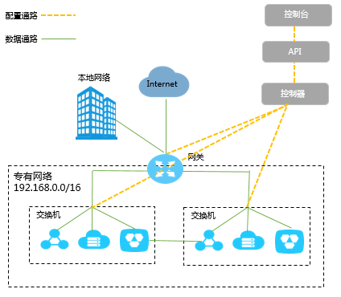

## 基本概念

* 专有网络（VPC）
  * 专有网络是您基于阿里云创建的**自定义私有网络**，不同的专有网络之间彻底逻辑隔离。您可以在自己创建的专有网络内创建和管理云产品实例，例如ECS，SLB，RDS等。
* 交换机（VSwitch）
  * 交换机是组成专有网络的基础网络设备。它可以连接不同的云产品实例。**在专有网络内创建云产品实例时，必须指定云产品实例所连接的交换机**。
* 路由器（VRouter）
  * 路由器是专有网络的枢纽。它可以连接专有网络的各个交换机，同时也是连接专有网络与其它网络的网关设备。路由器根据具体的路由条目的设置来转发网络流量。
* 路由表（Route Table）
  * 路由表是指路由器上管理路由条目的列表。
* 路由条目（Route Entry）
  * 路由表中的每一项是一条路由条目。路由条目定义了通向指定目标网段的网络流量的下一跳地址。路由条目包括系统路由和自定义路由两种类型。

## 限制约束

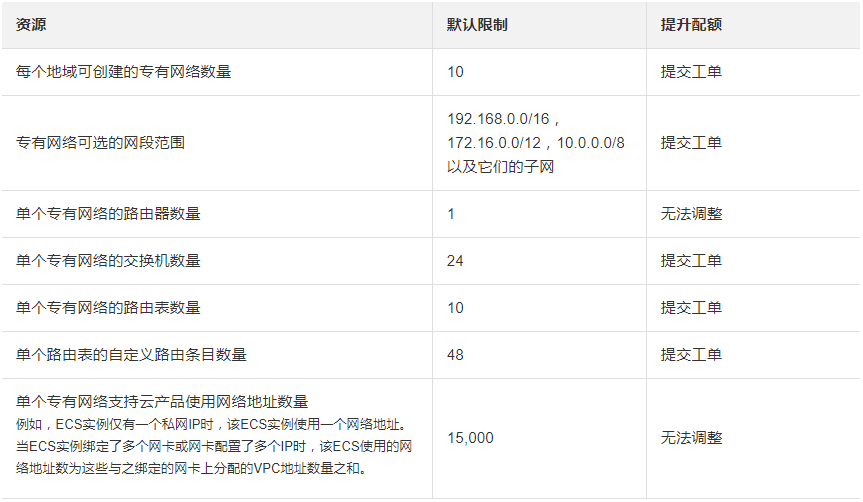

# VPC管理

## VPC列表

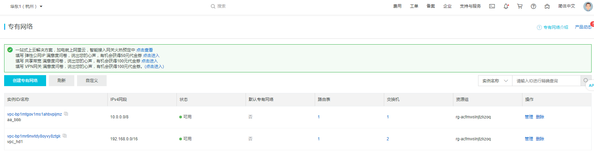

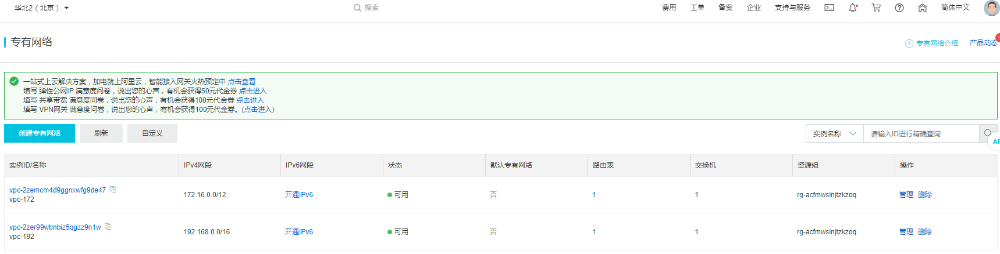

VPC列表总结：

1. 阿里云分区域提供了开启VPC IPV6网段的功能（白名单控制）；
2. 提供VPC根据ID和名字的精确匹配查询功能；
3. 提供显示VPC的路由表和交换机的数量，并可以点击进入相应的列表页面；
4. VPC对应资源组，租户可以从不同维度对资源进行统一管理；
5. 删除VPC前需要删除交换机、安全组；

## VPC创建

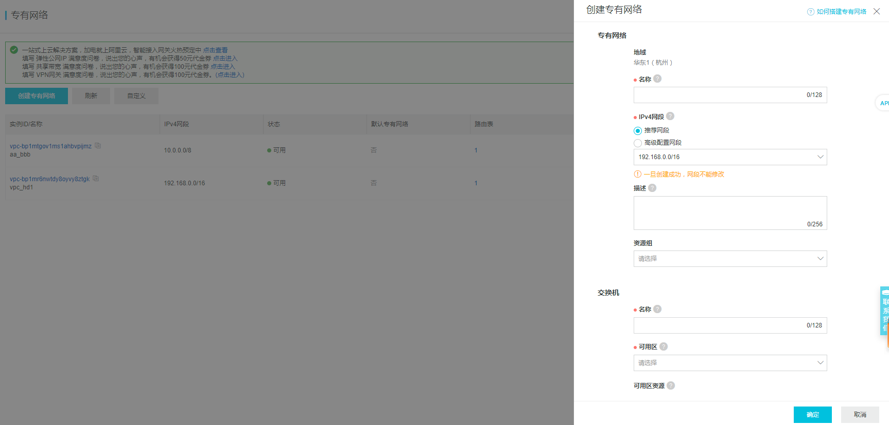

VPC创建总结：

1. 可以使用192.168.0.0/16、172.16.0.0/12和10.0.0.0/8这三个标准网段或其子集；
2. 支持开启IPV6网段的功能（白名单控制），系统指定范围；
3. 支持指定资源组，系统提供默认资源组；
4. 创建VPC时必须创建交换机（可用区、IP段、IPV6段）；
5. 创建VPC时，会同时创建路由器，该路由器管理一张路由表，租户不能删除/添加路由器，租户不能添加路由表；

## VPC管理

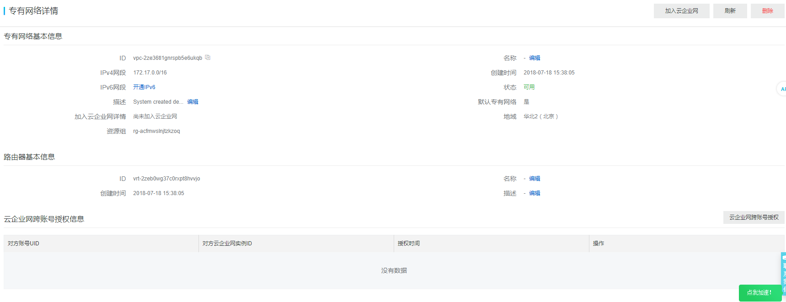

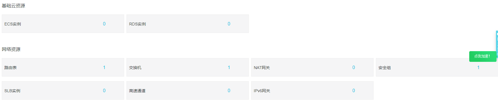

VPC管理总结：

1. VPC详情页面可以查看到VPC相关的所有相关信息（路由表、交换机、NAT网关、安全组、高速通道、IPV6网关）；
2. VPC详情页面可以查看到资源信息（云主机、RDS实例、SLB实例等）；
3. 相关修改操作直接在详情页面中，通过弹出对话框进行操作；
4. 提供VPC加入云企业网入口；

# 交换机管理

## 交换机列表

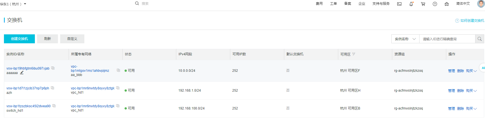

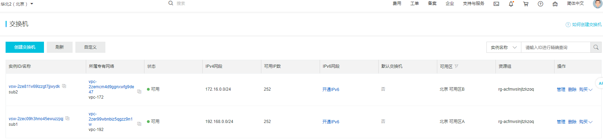

交换机列表总结：

1. 支持开启IPV6网段的功能（白名单控制）；
2. 显示所有VPC下的交换机；
3. 提供精确查询（实例ID、实例名称、VPC ID）功能；
4. 显示可用IP数（24位子网，可使用252个IP地址）

## 交换机创建

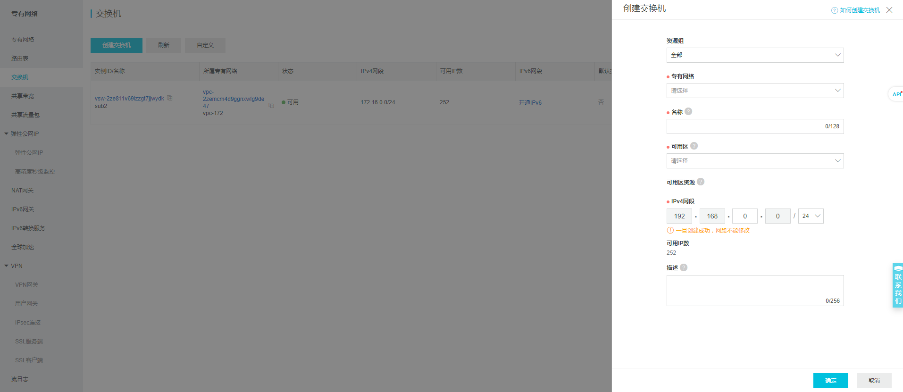

交换机创建总结：

1. 支持选择资源组；
2. 掩码长度采用下拉框，并提供了默认值（24），并提供了不同掩码长度下的IP设置的提示；

## 交换机管理

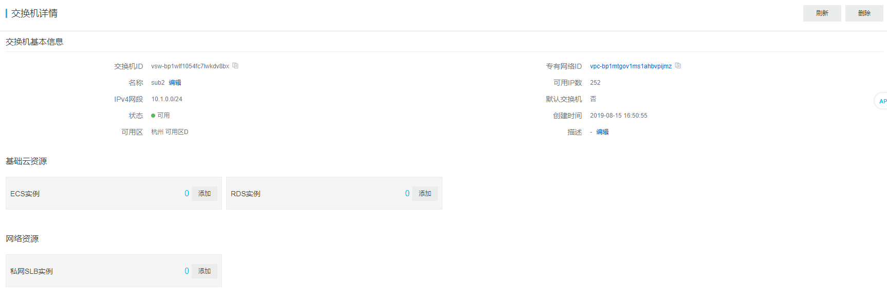

交换机管理总结：

1. 相关修改操作直接在详情页面中，通过弹出对话框进行操作；
2. 提供云资源创建入口；

# 路由表管理

## 路由表列表

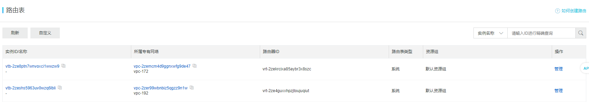

路由表列表总结：

1. 显示所属region下所有VPC的路由表；
2. 已去掉创建自定义路由表入口，用户使用系统默认创建的路由表，不支持用户删除路由表（系统路由表）；

## 路由表管理

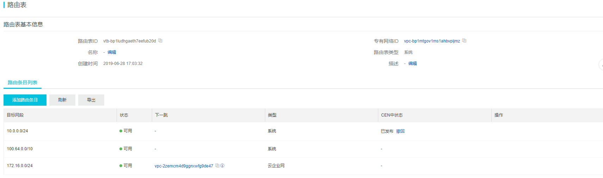

路由表管理总结：

1. 路由表详情页面可以直接修改部分信息，通过弹出对话框进行操作；
2. 支持路由添加、删除、导出、刷新等功能；

路由添加总结：

1. 路由下一跳支持云主机、VPN网关、NAT网关、辅助弹性网卡、路由器接口（专有网络方向）、路由器接口（边界路由器方向）等；
2. 创建公网NAT网关时，会自动添加路由：目的IP为0.0.0.0、下一跳为NAT网关；
3. VPC加入云企业网后，对端VPC添加交换机后，会自动添加路由：目的IP为该交换机网段、下一跳为对端VPC ID，类型为云企业网；
4. VPC加入云企业网后，本端VPC的交换机网段会自动发布出去，可以手动撤回；

