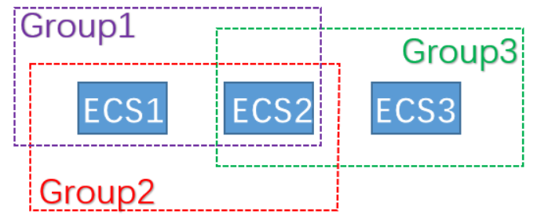

# Security Group

Security Group（安全组），用于定义资源和对象权限的任意访问控制列表 (DACL) 中的组， 在VPC中特指两个节点之间网络访问的控制， 类似Linux的iptables。

## 安全组隔离规则

* 安全组隔离是网卡之间的隔离，而不是ECS实例之间的隔离
  * 当主主机绑定多张网卡时，需要为每个网卡的IP地址配置安全组规则
* 安全组默认隔离策略
  * 同一安全组内的实例之间私网互通，不同安全组的实例之间默认私网不通

## 五元组

五元组是用来确定节点间的网络流，安全组规则就是在这五元组之上增加策略，来指定禁止或放行该网络流。

五元组的信息包括：

* 源IP地址
* 源端口
* 目的IP地址
* 目的端口
* 传输层协议

## 安全组规则

安全组规则根据流量方向，分为安全组入规则和安全组出规则。

安全组入规则支持：

* 源IP地址
* 目的端口
* 传输层协议

安全组出规则支持：

* 目的IP地址
* 目的端口
* 传输层协议

安全组规则同时支持禁止和允许两种策略，使用优先级来决定哪种策略生效，以简化安全规则数。

## 基于安全组的规则配置

基于IP段的规则配置比较容易理解，同时还支持基于安全组的规则配置。

Group1、Group2、Group3分别为3个不同的安全组，ECS1、ECS2、ECS3分别为3个不同的ECS实例。ECS1和ECS2同属安全组Group1和Group2，ECS2和ECS3同属安全组Group3。

隔离效果如下：

* ECS1和ECS2	互通
* ECS2和ECS3	互通
* ECS1和ECS3	隔离

